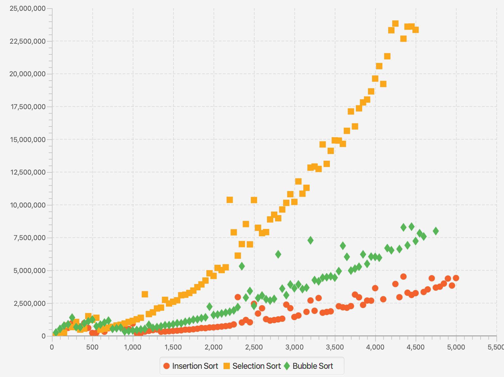
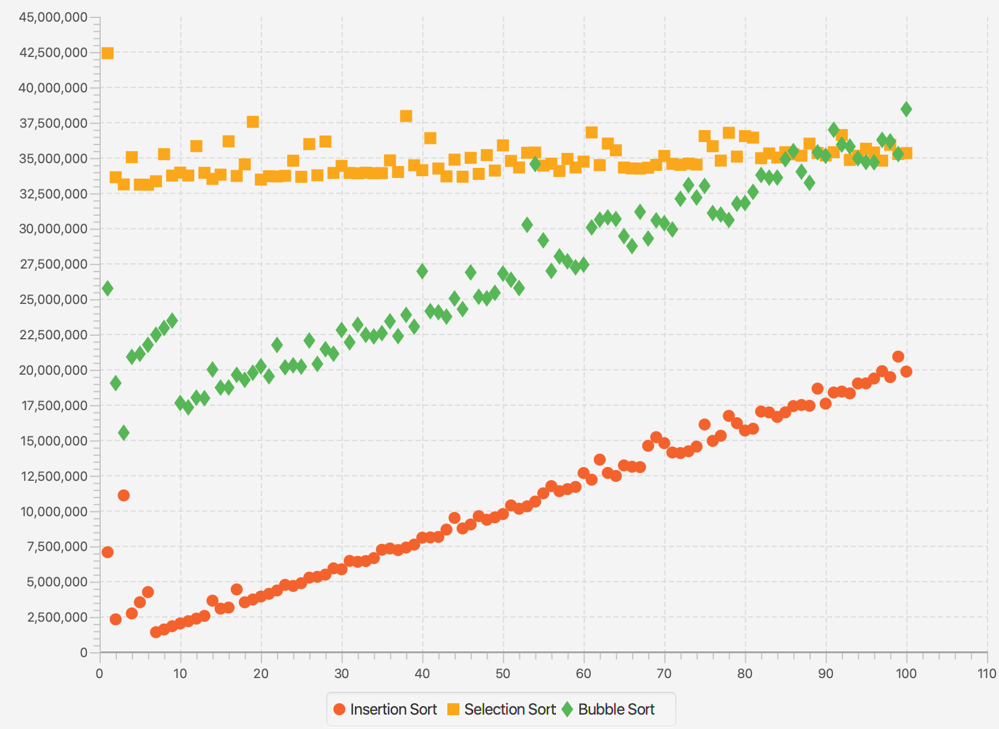
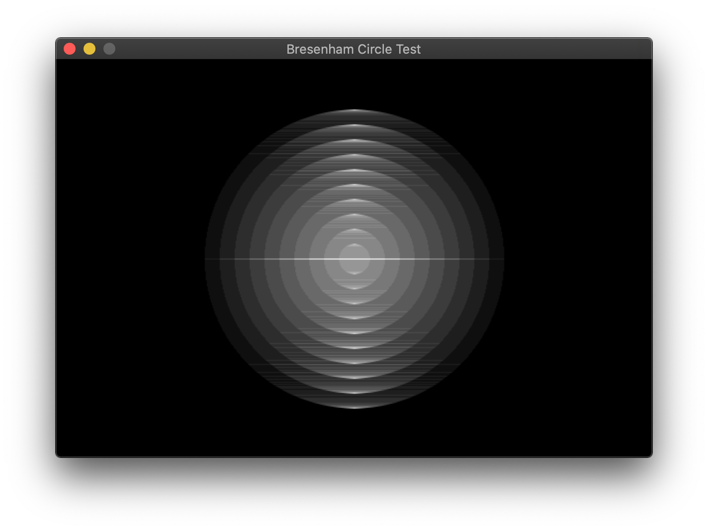
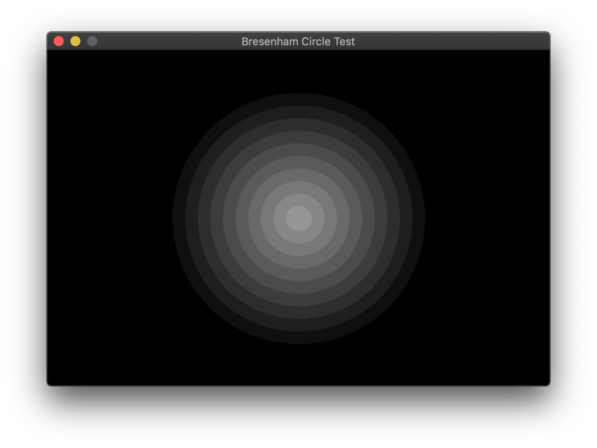
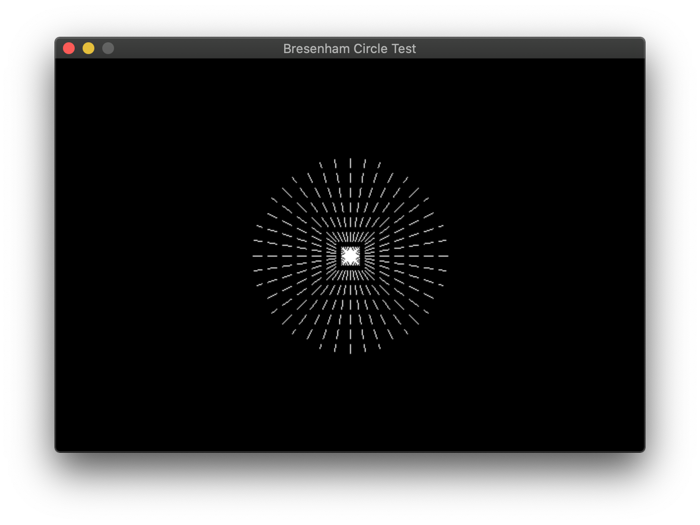

Title: Sorting Testbench in C
Date: 2020-11-11 19:20
Category: Programming
Tags: Programming, C, Algorithms
Slug: algorithms-in-c

I started reading CS theory in anticipation of my upcoming curriculum and I found
that CLRS starts the reader off with sort algorithms (technically they start with 
math and basic CS, but I've already covered that). I decided to make a Sorting 
testbench, whose requirements were pretty simple:

* It should be able to generate arrays of a given entropy: the entropy of an 
  array is defined as the number of swaps required to sort the array.
* It should be able to benchmark the time taken by each sort
* It should be able to plot the benchmark results in a single scatter plot, 
  using different colours for the different sorts.

The first implementation of this was done using Java and JavaFX (ps: setting up
JavaFX with Java 15 is a pain in the ass, but more on that in a later blog). 
The results were not too shabby, and I was able to accomplish a lot with 
very little code. However, I was unhappy with the performance: I believed that 
running the sorts on a JVM were not the way to go, and there were a lot of 
outliers in the data, where I believed the JVM paused for it's GC cycle and that
got recorded by the benchmarker. This was the reason I decided to switch to 
a language that was closer to the system, and that language was C.

Before that, here are some graphs from the Java version. This graph shows the 
time taken in nanos (y axis) vs array size (x axis). The $O(n^2)$ characteristic is 
clearly visible.



Here's one more, showing the time taken vs array entropy, which is linear in 
nature.



## Moving to C

Moving to C was difficult. The things I had to implement manually were:

1. ArrayList
2. PriorityQueue (via a Heap)
3. BitSet
4. Random int generator
5. Swap inserter
6. Circle drawing/filling algorithm
7. Dashed line drawing algorithm
8. Graph scale derivation algorithm
9. Sort algorithms

### ArrayList
Implementing an ArrayList was quite easy. The only tricky parts were resizing the 
ArrayList if the index overshot the current size. 
```c
void _ArrayList_expand(ArrayList *list) {
	list->capacity *= MULTIPLIER;
	list->data = realloc(list->data, sizeof(void*)*list->capacity);
}

int ArrayList_add(ArrayList *list, void *elem) {
	if (list->head >= list->capacity) {
		_ArrayList_expand(list);
		if (list->data == NULL) return ERR;
	}
	list->data[list->head++] = elem;
	log_debug("Added element at %d\n", (int)list->head-1);
	return OK;
}
```

### PriorityQueue
This was trickier. PriorityQueues are very well explained by [Algorithms, 4th ed](https://algs4.cs.princeton.edu/24pq/)
with adequate code examples and all I did was implement them. The core concepts
are the same as that of a heap: data is stored in a binary tree represented as an 
array, where the parent node of node $n$ is $\lfloor n/2 \rfloor$. This binary 
heap has an $O(\log n)$ access and removal time. The elements are inserted in 
any order and when they are removed, they are removed in sorted order. The link
does a better job of explaining it than I do, but here's how I implemented the 
primary methods in C
```c
void IntPQ_insert(IntPQ *ipq, int element) {
	if (ipq->head+1 >= ipq->size) {
		ipq->size *= MULTIPLIER;
		ipq->arr = realloc(ipq->arr, sizeof(int)*ipq->size);
	}
	ipq->arr[++ipq->head] = element;
	if (element >= ipq->emap_lb && element <= ipq->emap_lb+ipq->emap_size+1) {
		set_bit(ipq->emap, element-ipq->emap_lb);
	}
	int k = ipq->head;
	// swim element up
	while (k > 1 && ipq->arr[k/2] > ipq->arr[k]) {
		swap(&ipq->arr[k/2], &ipq->arr[k]);
		k /= 2;
	}
}

int IntPQ_remove(IntPQ *ipq) {
	if (ipq->head < 1) {
		log_debug("Stack is empty\n");
		return -1;
	}
	int min = ipq->arr[1];
	ipq->arr[1] = ipq->arr[ipq->head--];
	// sink first element
	int k = 1;
	while (2*k <= ipq->head) {
		int j = 2*k;
		if (j <= ipq->head-1 && ipq->arr[j] > ipq->arr[j+1]) j++;
		if (ipq->arr[k] < ipq->arr[j]) break;
		swap(&ipq->arr[k], &ipq->arr[j]);
		k = j;
	}
	return min;
}
```

### BitSet

The `set_bit` function in the previous code sample must have raised some questions. 
The PriorityQueue has a Bitset that facilitates $O(1)$ checking for elements in the array. Generally, a 
HashTable would be better suited, but I didn't get around to implementing one 
of those. A BitSet implementation is well described 
[here](https://stackoverflow.com/questions/4372515/how-to-implement-a-bitset-in-c)
and I did something similar here, so no worries there. It's not very memory efficient, 
but it's good enough for the range of integers I generate.

### Random Number Generator

C comes with a built-in random number generator, implemented with the `rand()` 
and `srand()` functions. However, the implementation of those functions varies
wildly from platform to platform, which I documented in 
[this question](https://stackoverflow.com/questions/64619808/clang-poor-rand-implementation)
and the algorithm is also well documented in [this medium post](https://medium.com/macoclock/are-random-number-on-mac-truly-random-c70e65630ce).
`rand()` on mac is taken from BSD, which says in it's own documentation that 
it's a bad random number generator. The solution is to use `random()` and `srandom()`
on mac, which is comparatively better. The maximum value of the random number 
generated using this method is $2^{31} - 1$. Using this, generating random 
number within a given range is simple, and can be done using the following 
snippet:

```c
int gen_int(int lb, int ub) {
	return (int)(((double)random())/RANDOM_MAX*(ub-lb) + lb);
}
```

Using this along with the PriorityQueue, we can generate an array of sorted 
random numbers, into which swaps are then inserted.

### Swap Inserter

A swap or inversion is defined as a pair of integers at indices $i$ and $j$ 
such that $i < j$ and $A[i] > A[j]$, assuming the array is to be sorted in 
ascending order. An array of length $n$ sorted in descending order has $\frac{n(n-1)}{2}$
inversions. If we have to insert $k$ inversions into a sorted array, take the 
first $m$ integers such that $m(m-1)/2 < k$. Reverse the order of these first 
$m$ integers so that they're in descending order. We now have to insert 
$k - m(m-1)/2$ swaps in the leftover array. To do this, take the last element 
in the array (which is the largest) and move it back by $k - m(m-1)/2$ steps, 
thereby inserting those many number of swaps.

### Circle drawing & filling algorithm

Now that the integer generation side of things is done, we can move on to the 
graphics side of things. I use SDL for all my graphics work with C and SDL 
does not have a `SDL_RenderDrawCircle` or `SDL_RenderFillCircle` method. Since 
circles are a must have primitive, I implemented my own circle drawing and 
filling algorithm. This is based on the [midpoint circle algorithm](https://en.wikipedia.org/wiki/Midpoint_circle_algorithm) and draws 
(and fills) non-antialiased circles.

```c
static void render_circ_pts(SDL_Renderer *renderer, int x0, int y0, int x, int y) {
	SDL_RenderDrawPoint(renderer, x0+x, y0+y);
	SDL_RenderDrawPoint(renderer, x0-x, y0+y);
	SDL_RenderDrawPoint(renderer, x0+x, y0-y);
	SDL_RenderDrawPoint(renderer, x0-x, y0-y);
	SDL_RenderDrawPoint(renderer, x0+y, y0+x);
	SDL_RenderDrawPoint(renderer, x0-y, y0+x);
	SDL_RenderDrawPoint(renderer, x0+y, y0-x);
	SDL_RenderDrawPoint(renderer, x0-y, y0-x);
}

static void render_circ_lines(SDL_Renderer *renderer, int x0, int y0, int x, int y, bool xch) {
	// renders every point only once, so rendering with alpha < 0xFF is not an issue. 
	// also note the +1 for x2; SDL does not draw the last point in a line
	SDL_RenderDrawLine(renderer, x0-x, y0-y, x0+x+1, y0-y);
	if (y != 0) {
		SDL_RenderDrawLine(renderer, x0-x, y0+y, x0+x+1, y0+y);
	}
	if (xch && x != y) {
		SDL_RenderDrawLine(renderer, x0-y, y0-x, x0+y+1, y0-x);
		SDL_RenderDrawLine(renderer, x0-y, y0+x, x0+y+1, y0+x);
	}
}

static void render_circle(SDL_Renderer *renderer, int cx, int cy, int r, bool fill) {
	int x = r;
	int y = 0;
	int dx = 1-2*r;
	int dy = 1;
	int re = 0;
	bool xch = true;
	while (x >= y) {
		if (fill) render_circ_lines(renderer, cx, cy, x, y, xch);
		else render_circ_pts(renderer, cx, cy, x, y);
		xch = false;
		y++;
		re += dy;
		dy += 2;
		if (2*re + dx > 0) {
			xch = true;
			x--;
			re += dx;
			dx += 2;
		}
	}
}

void SDL_RenderDrawCircle(SDL_Renderer *renderer, int cx, int cy, int r) {
	render_circle(renderer, cx, cy, r, false);
}

void SDL_RenderFillCircle(SDL_Renderer *renderer, int cx, int cy, int r) {
	render_circle(renderer, cx, cy, r, true);
}
```

This is the entire algorithm, capable of drawing both filled and unfilled circles. 
it's easy to draw filled circles as shown by the algorithm here as well as in 
Wikipedia, but drawing filled circles is trickier, because you don't want to 
go over a single point multiple times. This raises problems if your alpha is 
less than 1. To counter this, you only draw lines when the x (or the y) changes
and if x is not equal to y. Here's what the result would look like if you went 
over lines multiple times:



Here's what it looks like if you go over each pixel once



Much better!

### Dashed Line Drawing Algorithm

This is an implementation of the Bresenham algorithm for drawing lines. I needed 
to draw only horizontal and vertical dashed lines to make the graph gridlines, 
but I decided to make a full-fledged implementation of Bresenham's algorithm 
to draw dashed lines. Again, this is an algorithm that SDL does not ship with; it 
can only make solid lines and I had to implement this myself. Bresenham's 
algorithm is decently simple and can be found in any graphics programming book. 
The main concept behind the algorithm is making a choice between plotting 
$(x+1, y+1)$ or $(x+1, y)$ for a line with a slope between 0 and 1. Mirroring / 
flipping the algorithm gives you the line in the eight other octants. 

This implementation for all 8 octants took quite a bit of head scratching as 
most of the algorithms online used to work only in the first quadrant, or they 
had different algorithms for other quadrants with repeated code, which was 
messy. The key here is to realize that the increment can be either positive 
or negative, but the error term will always be positive. The comments should 
clarify this algorithm, as I wrote them to help me understand what's happening
where and when.
```c
// Bresenham line algorithm
// similar to SDL_RenderDrawLine: draws x0, y0 and does not draw x1, y1 (x0 <= L < x1)
void SDL_RenderDrawDashedLine(SDL_Renderer *renderer, int x0, int y0, int x1, int y1, int dashlen, int blanklen) {
	int Dx = x1 - x0;
	int Dy = y1 - y0;
	// dirx, diry - direction of line
	// the direction being iterated over is 1 or -1, and the other one is 0
	int dirx = 0, diry = 0;
	// incx, incy - increment of line
	// the direction being iterated over is set to the same as dirx, while 
	// the other one is 1, -1 or 0 depending on line direction.
	int incx = 0, incy = 0;

	// first find the variable we will be iterating over - X or Y
	int longest = abs(Dx);
	int shortest = abs(Dy);
	if (longest < shortest) {
		// We'll iterate over y, so swap longest and shortest and then set dir* 
		// and inc* appropriately
		swap(&longest, &shortest);
		dirx = 0;
		if (Dx < 0) incx = -1; else if (Dx > 0) incx = 1;
		if (Dy < 0) diry = -1; else diry = 1;
		incy = diry;
	}
	else {
		// Iterating over x
		diry = 0;
		if (Dy < 0) incy = -1; else if (Dy > 0) incy = 1;
		if (Dx < 0) dirx = -1; else dirx = 1;
		incx = dirx;
	}

	int err = 0;
	int x = x0;
	int y = y0;
	// main drawing loop
	for (int i=0; i<longest; i++) {
		if (i%(dashlen+blanklen) < dashlen)
			SDL_RenderDrawPoint(renderer, x, y);
		err += shortest;
		if (2*(err+shortest) < longest) {
			x += dirx;
			y += diry;
		}
		else {
			err -= longest;
			x += incx;
			y += incy;
		}
	}
}
```

This produces some pretty good results, and I can live with the distances not 
exactly adhering to Pythagoras theorem, as highlighted by the rectangular rather 
than radial boundaries for the dashes.



### Graph Scale Derivation Algorithm

After making the primitive drawing algorithms, we can move on to drawing the 
graph. Determining the scale of the graph is the only mathematical and challenging 
part of drawing the graph, because the rest is mostly drudgework. I used 
[this StackOverFlow question](https://stackoverflow.com/questions/326679/choosing-an-attractive-linear-scale-for-a-graphs-y-axis)
as a base and developed my algorithm using that. The only difference is that 
I floor the value while calculating lower bound rather than rounding it. The 
following code should make the algorithm clear

```c
static int round_tr(double tr) {
	int nd = (int)(log10(tr))+1;
	double exp = pow(10, nd);
	double str = tr/exp;
	if (str <= 0.1) return round(0.1*exp);
	if (str <= 0.2) return round(0.2*exp);
	if (str <= 0.25) return round(0.25*exp);
	if (str <= 0.5) return round(0.5*exp);
	if (str <= 0.75) return round(0.75*exp);
	return round(exp);
}

.
.
// in the range determination function. Do similarily for y
if (xMin != xMax) {
	double range = xMax - xMin;
	gd->xtickrange = round_tr(range/numxticks);
	gd->xlbound = gd->xtickrange*floor(((double)xMin)/gd->xtickrange);
}
.
.
```

### Sort Algorithms

After the amount of stuff we have gone through, the sort algorithms now seem 
trivial and easy. I just implemented some $O(n^2)$ algorithms to start off 
with: Selection sort, bubble sort and insertion sort. I also created a `Sort` 
structure containing a function pointer and a string, which I would use to 
link the sort with a name. Here are the sorts I started off with:
```c
void selection_sort(int n, int *A) {
	for (int i=0; i<n; i++) {
		int index = i;
		for (int j=i+1; j<n; j++) {
			if (A[j] < A[index]) index = j;
		}
		if (index != i)
			swap(&A[index], &A[i]);
	}
}

void bubble_sort(int n, int *A) {
	for (int i=0; i<n; i++) {
		for (int j=0; j<n-i-1; j++) {
			if (A[j] > A[j+1]) {
				swap(&A[j], &A[j+1]);
			}
		}
	}
}

void insertion_sort(int n, int *A) {
	for (int i=0; i<n; i++) {
		int k = A[i];
		int j = i-1;
		while (j>=0 && k < A[j]) {
			A[j+1] = A[j];
			j--;
		}
		A[j+1] = k;
	}
}
```

Here's the timing and plotting main function:
```c
int main(int argc, char **argv) {
	srandom(time(NULL));
	ArrayList *sortList = new_ArrayList();
	ArrayList_add(sortList, new_Sort("Selection Sort", &selection_sort));
	ArrayList_add(sortList, new_Sort("Insertion Sort", &insertion_sort));
	ArrayList_add(sortList, new_Sort("Bubble Sort", &bubble_sort));
	ArrayList_add(sortList, new_Sort("Merge Sort", &merge_sort));

	ArrayList *dataList = new_ArrayList();
	for (int i=0; i<sortList->head; i++) {
		Sort *s = sortList->data[i];
		ArrayList_add(dataList, new_DataSet(s->name));
	}
	bool err = false;
	
	for (int c=50; c<=5000; c+=50) {
		log_debug("Creating random array of size %d\n", c);
		int *ranarr = gen_ints(c, LBOUND, UBOUND, 0.8);
		for (int i=0; i<sortList->head; i++) {
			log_debug("allocating array of size %d\n", c);
			int *arr = malloc(sizeof(int)*c);
			memcpy(arr, ranarr, c);
			Sort *s = ArrayList_get(sortList, i);
			void (*sort)(int, int*) = s->sort;
			clock_t begin = clock();
			(*sort)(c, arr);
			clock_t end = clock();
			int time_spent = round(1000000.0*(end-begin)/CLOCKS_PER_SEC);
			if (!is_sorted_asc(c, arr)) {
				err = true;
				log_debug("Sort %d failed\n", i);
				free(arr);
				break;
			}
			else {
				log_debug("Sort %d passed\n", i);
				DataSet_add(dataList->data[i], new_Point(c, time_spent));
			}
			free(arr);
		}
		free(ranarr);
		if (err) break;
	}
	if (!err) {
		plotAll(dataList->head, (DataSet**)dataList->data, "Sorts - Time (us) vs Array Size");
	}
	for (int i=0; i<sortList->head; i++) {
		destroy_Sort(sortList->data[i]);
		destroy_DataSet(dataList->data[i]);
	}
	destroy_ArrayList(sortList);
	destroy_ArrayList(dataList);
	
	return 0;
}
```

This didn't work the first time and threw a segfault in my face :\_( How typical 
of C. I did debug it, and I'm pretty pleased with the results.


### Conclusion

There are a lot of things that I have to improve here, some of which include

1. Antialiasing circles and lines
2. More sorts - $O(n\log(n))$ and $O(n)$ sorts
3. Resizeable graphics
4. More customizable layouts
5. More flexible graphing - lines, histograms etc.

I could have left the graphing to R or Python and just exported a CSV, but 
where's the fun in that. 

This project taught me more about graphics than it did about sorts and will continue to teach me more 
as I keep working on it. For more updates, check out the repository [here](https://github.com/Aniruddha-Deb/Algorithms).
