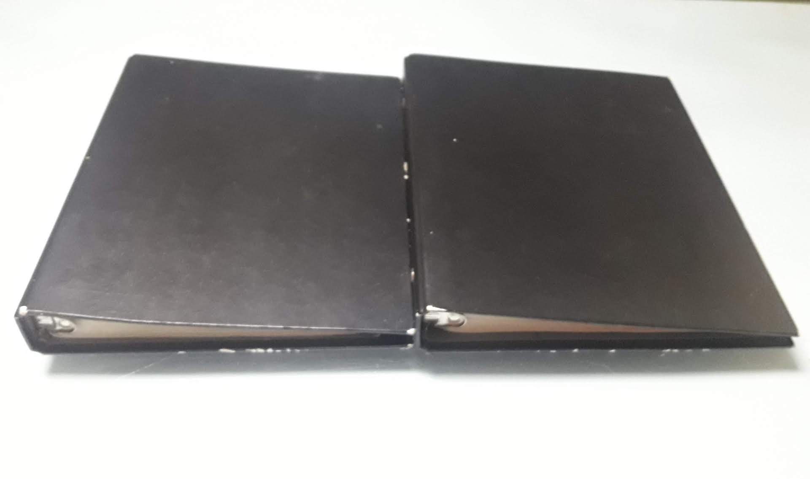
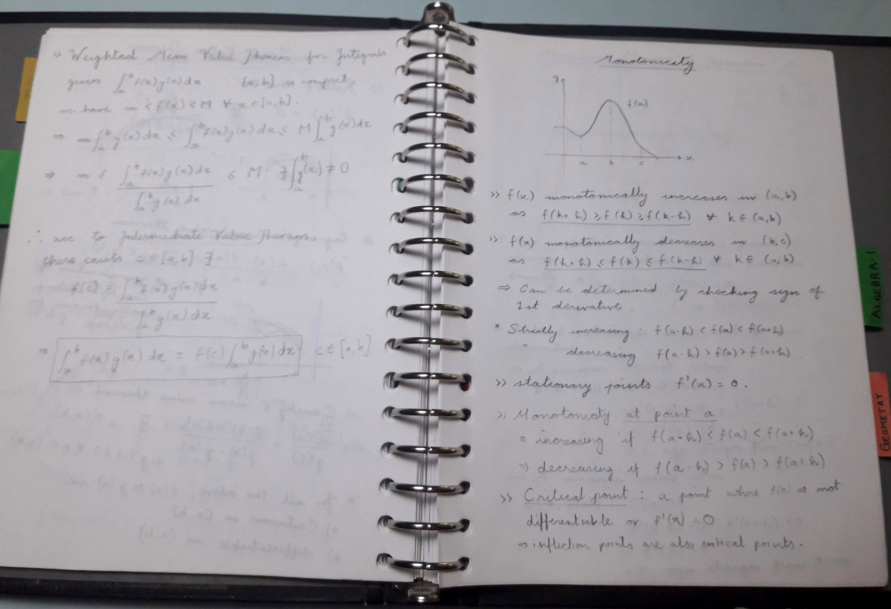
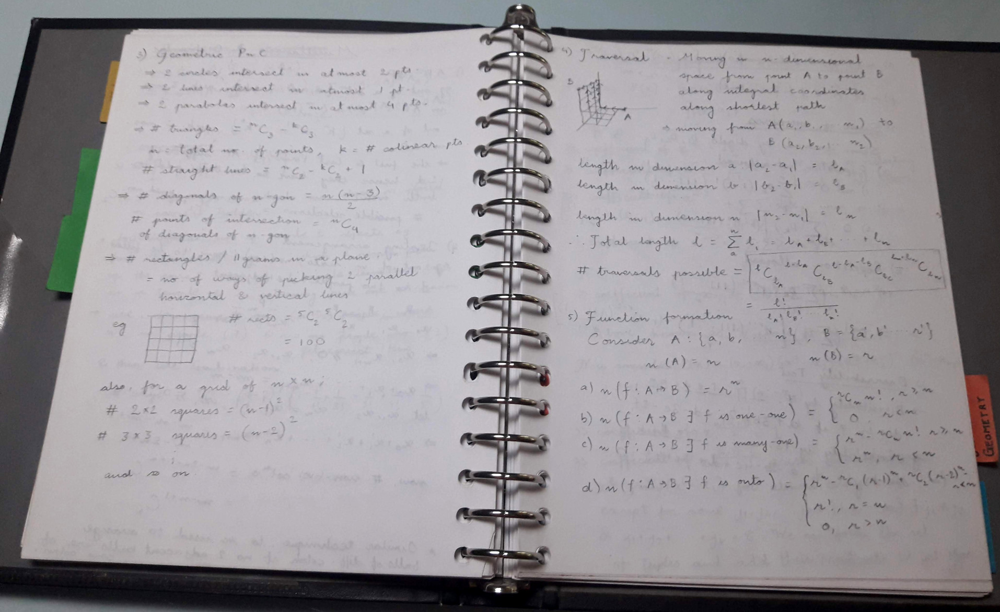
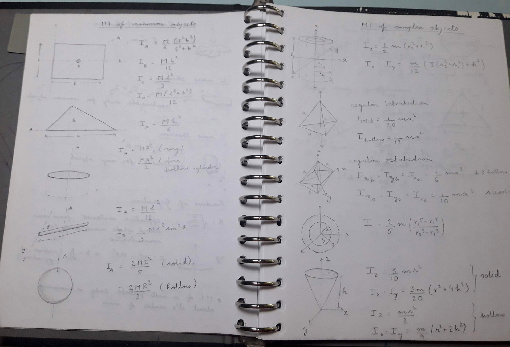

Title: Setting up MathNotes - an online math repository
Date: 2020-10-16 12:54
Category: Mathematics
Tags: Mathematics, Programming
Slug: mathnotes-launch.md

Just after 10th and as I was beginning my JEE Preparation, I felt the need for 
an extensible note-taking apparatus. Online notes would be too much trouble 
and would keep me hooked to the computer. Notebooks were also difficult, as 
I wanted my notes to be extensible; adding pages in the middle of a notebook 
is extremely difficult. I finally settled on using Binders; you can add/remove
pages quite easily and they're decently sized to accommodate all the notes you
could ever need.

I took out two old binders; they had ~120 pages each and used one for math and 
one for physics. Soon enough, I had to get more pages and by the end of my 
JEE Journey, the binders had somewhere around 200 pages, each filled with notes

Left one is maths, right one is physics

These tend to follow a very hierarchical format, and also tend to be extremely 
diverse with symbols and diagrams (I did all the notes in pencil, so that if 
any errors arise, I can change the content). 

I now needed a note-taking repository that had the same level of extensibility 
and one that I could use through college life. The computer was not a limitation 
now, and I was also decently skilled in LaTeX by now. I decided to make an 
online website using Sphinx and Read the docs, for keeping my math notes. 

I followed the great guide by Ryan Dale on [settting up sphinx on GitHub Pages](https://daler.github.io/sphinxdoc-test/includeme.html). 
I took a few liberties with the folder structure, but now setting up the repo
for contributors is as simple as cloning the repo and running the `install.sh` 
script in it. 
The website is now live at [https://aniruddha-deb.github.io/MathNotes](https://aniruddha-deb.github.io/MathNotes), 
and I will be porting all my math and physics content over, and also creating 
notes in the future, for the math courses that I take.

This means that this blog would feature fewer 'Math Notes' sections that I 
spoke about previously (link [here](https://aniruddha-deb.github.io/articles/2020/math-notes-1.html)).
The math content will also go down, but I will continue to write about math 
stuff that made me go 'wow' (there are a few of those coming in the future, 
so stay tuned)

If you would like to contribute to the math notes repository, feel free to 
reach out to me on my eMail, by clicking the mail icon in the sidebar.
