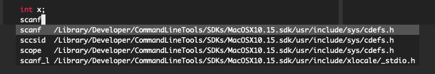

Title: C development on a Mac
Date: 2021-03-18 11:46
Category: Programming
Tags: Programming, C
Slug: c-mac

C development on a Mac has it's fair share of traps and pitfalls, even though
Mac is supposed to be POSIX compliant. I'll cover a few of them here, with the
hope that nobody repeats the same mistakes :)

## XCode CLT Pitfalls

The first thing one does while starting out with C development is to install
a compiler. This is slightly more complicated than it looks on Mac: the simple
way is to go the way of installing XCode command line tools, but there's a few
things here to note:

### You have to be an apple developer
This means that you can't have a C/C++ toolchain without being a part of
of their developer program. There is a (messy) way of working around this, by instead
installing and using GCC with HomeBrew, but I'll get to that in a minute. 

### XCode CLT uses the `clang` toolchain
This is by far the most important pitfall, as XCode purposefully misaliases 
a lot of stuff. After installing XCode CLT (and provided that you don't have
GCC installed or aliased), try doing a `gcc -v` or `g++ -v`. You'd get
```text
Configured with: --prefix=/Library/Developer/CommandLineTools/usr --with-gxx-include-dir=/usr/include/c++/4.2.1
Apple clang version 12.0.0 (clang-1200.0.32.27)
Target: x86_64-apple-darwin19.6.0
Thread model: posix
InstalledDir: /Library/Developer/CommandLineTools/usr/bin
```
This is quite misleading, as `gcc` and `clang` are fundamentally different 
compilers. [Here's one example of that](https://stackoverflow.com/questions/25745759/clang-vs-gcc-vs-msvc-template-conversion-operator-which-compiler-is-right/25758367#25758367).
A more accessible example would be this:
```c
int x = 3;
int z = x/++x;
```
try compiling this with `gcc` and `clang`, and be surprised\*.

### Headers? What Headers?
Headers are also *very weirdly located* in `/Library/Developer/CommandLineTools/SDKs/MacOSX10.15.sdk/usr/include`,
and these headers are also **not** symlinked to `/usr/include` by the installer.
This sucks, and I struggled with making vim autocomplete work because of this
reason; vim's path searches `/usr/include` and not this weird obscure path.
Once I manually included it, it <strike>looked horrible and I needed to symlink it
to /usr/include</strike> worked okayish.



One note is that you could also use the path `/Library/Developer/CommandLineTools/SDKs/MacOSX.sdk/usr/include`,
as `MacOSX.sdk` is linked to the latest version of SDK installed. This does not
make the location of includes any less weird. 

Another thing to note is that other libraries install their headers in `/usr/local/include`,
so this discrepancy is bad. This has also not been fixed in Big Sur: how hard
is it to keep a set of headers in `/usr/include` rather than in this unsightly
place! I mean every UNIX system does this! Ugh

### CTags

CLT also ships with the old ctags rather than exuberant ctags, which is basically
useless. Neither is there a simple way to distinguish between the ctags that
it ships and exuberant ctags until it fails hard when you go to make your tags
file, since they have the same `ctags` command. The way of fixing this is to 
install the proper ctags with `brew install ctags` and then add 
`alias ctags=/usr/local/include/ctags` to your `.zshrc`.

## Using GCC

So you decide that the `clang` toolchain is not working out for you (maybe because
it's slow or for other reasons), and you decide to switch to the `gcc` toolchain
(by Toolchain, I refer to all associated tools, so that's `gcc`, `g++`, `gdb` etc).
Installing the tools are quite easy, and they just happen with 
`brew install gcc gdb`. However, `gcc` and `g++` are already taken by `clang`,
so you'll have to export them in your `.zshrc` again
```bash
alias gcc=/usr/local/bin/gcc-10
alias g++=/usr/local/bin/g++-10
```

GDB, however, is *very* tricky to get working right; MacOS due to SIP and 
Gatekeeper, does not allow running processes to latch on to other processes.
For GDB to work, it would need to be signed. For this, you'll have to sign
it yourself with a certificate, and add that certificate to the trusted
keychain in your system. I *still* could not get it to work after this (more
info [here](https://dev.to/jasonelwood/setup-gdb-on-macos-in-2020-489k)), and 
just using `sudo` was a hack that I used while I tried to get GDB to work. 
LLDB, however, is much better integrated with debugging, and I eventually
shifted over to using LLDB rather than GDB (aided by [this](https://lldb.llvm.org/use/map.html)
resource). 

The GCC/G++ aliasing is highly recommended, and you could leave out GDB (which
is what I've done in my current setup)

## Other stuff

`make` seems to work without a hitch so far, which is a good thing. `cscope` 
also had to be installed with brew, and cscope also works well now. I'll need 
to finish setting up my vim environment for C autocompletion and play around
more with CTags and cscope (maybe write about it in the next post :)) For 
now, this has unfortunately turned into more of a rant than a how-to, but I
still hoped it help some of you avoid these traps and pitfalls.

-----------

\*: GCC gives the output as 1, while clang gives it as 0
