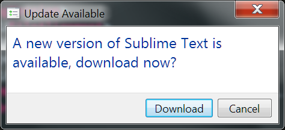
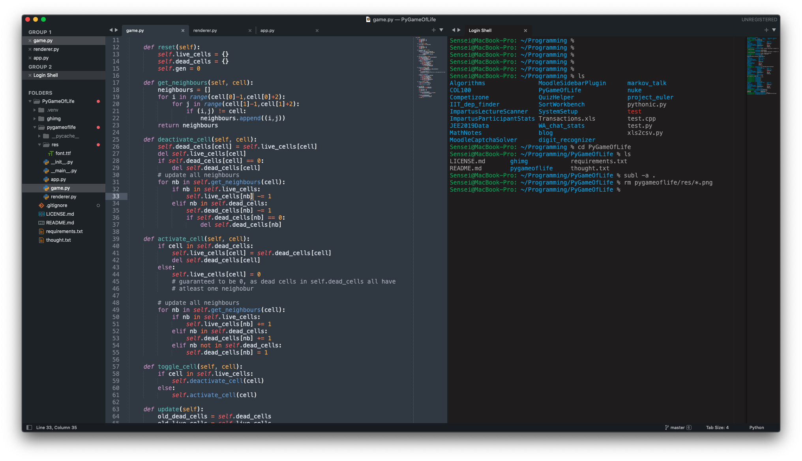

Title: Setting up (and shifting to) Sublime Text 4
Date: 2021-06-01 08:03
Category: Programming
Tags: Programming, Text Editor
Slug: sublime-text-setup

After using vim for a _long_ time, I realized that vim would be very tricky to
use for larger projects; there are a few reasons behind this, which are:

1. **Hard to set up and use autocomplete**: I've tried omnicomplete, but it just didn't cut the mustard. I very seldom need something like whole line completion and all the other gimmicky stuff that was in it. I heard that setting up other autocompletes on vim were really tricky, and that vim by virtue of being single-threaded wasn't great at this stuff. I had used VSCode once, and the only thing I really took away was how great intellisense is. I really didn't want to go back to VSCode, so sublime seemed like a good alternative

2. **Where are the directories?** There is no way to view folders in vim unless you have a folder viewing plugin. Once you have a good grip on the way of the keyboard, Vim is kind of pointless until you start adding plugins. You even need a plugin to add auto-completing brackets! I finally realized that vim would be hard to use realistically if I have to tackle a larger programming project, where I would need to see the folders and files and have autocomplete on hand.

3. **Neovim? Do I have to set that up?** NeoVim is the 'better' version of vim that everyone uses, because it's multithreaded and more of a community effort. however that has another bunch of setup for making it usable, and coc.nvim is the completion tool of choice there. Though I could have gone the nvim way, I decided that setting up sublime text would be effort better spent, since it's already usable and fast. 

So here's the way I made sublime my own over a tuesday evening:

### Update, Update, Update!

Everytime I opened up Sublime, I was greeted with the annoying update window<sup>1</sup>

<center></center>

I finally went ahead and updated it. Sublime text had come up with version 4 recently, and the only change was *drumrolls* A new default color scheme! How original.<sup>2</sup>. Well, it's still a great color scheme, even I was getting bored of monokai.

### Installing the smaller plugins

There are 3 'small' plugins I installed (plugins that require minimal work to setup):

1. A file Icon - cool file icons in the sublime text sidebar
2. Terminal - open a terminal with the current file with one keystroke (⌘⇧T)
3. NeoVintageous - _much_ improved vim plugin; vintageous pales in comparision

all of these (except Terminal) required no setup; I just hit ⌘⇧P -> install packages -> type the package name in, hit enter and done. Terminal required that I specify that I have iTerm2 

```JSON
{
    "terminal": "iTerm2-v3.sh",
    "parameters": ["--open-in-tab"]
}
```

### Installing the larger autocomplete plugins

I mainly code in C/C++/Python nowadays, so I needed a Python autocomplete, as well as a C/C++ autocompleter. Jedi is what I used to use for python a long time back, and surprisingly it's still quite well maintained and documented. I installed Jedi via the package control. Jedi has some interesting settings regarding projects and virtual environments; I didn't get to try any of those out, but I did set it up on the default python interpreter on my system. 

```JSON
{
	"python_interpreter": "/Users/Sensei/.pyenv/versions/3.9.0/bin/python",
	"python_package_paths": [
        "/Users/Sensei/.pyenv/versions/3.9.0/lib/python3.9/site-packages"
    ]
}
```

and that's it! Jedi now autocompletes both normal python and all packages that I install with pip (numpy, scipy etc). Great!

I was left with setting up a C++ autocompleter, and this was a bit tricky. The first recommendation that I encountered was for ClangAutoComplete, but after downloading it, it stated that the plugin is still maintained, but not very actively. ClangAutoComplete instead recommended EasyClangComplete, so I uninstalled it and downloaded ECC. ECC had a few setup issues; everything is hunky-dory if you use CMake, but since I don't, I had to tweak the preferences a bit. I had already ranted about [How the C header locations on mac are screwed](https://aniruddhadeb.com/articles/2021/c-mac.html), and fortunately the ECC folks were kind enough to provide a recommended path list for mac.

```JSON
{
	"common_flags" : [
	    "-I/usr/include/",
	    "-I/usr/local/include",
	    "-I/Library/Developer/CommandLineTools/usr/lib/clang/12.0.0",
	    "-I/Library/Developer/CommandLineTools/usr/include/c++/v1",
	],
    "lang_flags": {
        "C": ["-std=c99"],
        "CPP": ["-std=c++14"],
        "OBJECTIVE_C": ["-std=c11"],
        "OBJECTIVE_CPP": ["-std=c++14"],
    },
	"libclang_path": "/Library/Developer/CommandLineTools/usr/lib/"
}
```

### Further updates

The next day, I went ahead and realized that terminal wouldn't cut it, and I needed a terminal integrated into sublime text. I went ahead and installed the Terminus plugin for that. Terminus by default hides some of it's keybindings, so I had to go and change the keybinding user preferences. Now `` alt+` `` opens up a terminal where the default sublime terminal goes, and `ctrl+alt+T` opens up a terminal in place of a text pane. The default user theme was too dark for my taste, so I changed it with the 3024-dark theme that terminus ships with. This config works perfectly: no need to split sublime into two with a terminal, or open iTerm every time I use sublime! Here's a screenshot (the project in question is [PyGameOfLife](https://github.com/Aniruddha-Deb/PyGameOfLife))



That's about it; everything now works and works well! NeoVintageous is probably the thing that is the best; it is miles ahead of vintageous, and it works brilliantly here. I don't feel like I've left vim, until sublime writes methods for me, closes braces/tags for me and also autocompletes my 3 dimensional vector definition. Which is great. I'll post more updates here if I do install/delete some plugins, but I have a feeling sublime is here to stay.

-------

<sup>1</sup>Yes I didn't screenshot it on my mac, which is why it's a windows SS, thanks to Colonel Panic at StackOverflow for the image

<sup>2</sup>They did change a lot of stuff; the rendering is now faster on newer devices, and a lot of updates would have gone into it behind the scenes, so this is just a joke :P gg @SublimeHQ, Sublime text 4 does look amazing :)