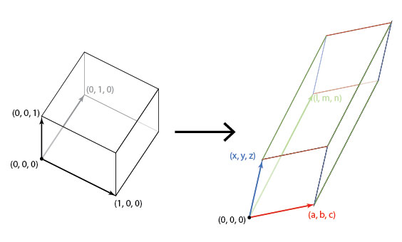

$\newcommand{\pdv}[2]{\frac{\partial{#1}}{\partial{#2}}}$
$\newcommand{\ah}{\pmb{a} + \pmb{h}}$
$\newcommand{\a}{\pmb{a}}$
$\newcommand{\h}{\pmb{h}}$
## The Jacobian Matrix

Consider a function that maps reals to reals, $f:\Bbb{R} \to \Bbb{R}$. The linear
approximation of this function is given by 
$$f(a+h) \approx f(a) + hf'(a)$$
This is pretty simple to do, and follows from taylor's expansion upto the first order.

Let's try expanding this concept to vector spaces. For a function $f:\Bbb{R}^n \to \Bbb{R}$, 
it's linear approximation is given by 
$$f(\pmb{a} + \pmb{h}) \approx f(\pmb{a}) + \pmb{h}\cdot\nabla{f}(\a)$$
(bold type indicates vectors). This also follows from the taylor theorem for 
multivariable functions.

What do we do when we have a function mapping vector spaces to vector spaces?
Consider the function $f:\Bbb{R}^n \to \Bbb{R}^m$. What would be the approximation
term here?
$$f(\pmb{a} + \pmb{h}) \approx f(\pmb{a})\ +\ ???$$

Let's try to solve this by decomposing the function $f:\Bbb{R}^n \to \Bbb{R}^m$
into $f\_i:\Bbb{R}^n \to \Bbb{R}$, $i = 1, 2, \cdots ,m$. For each $f\_i$, we get
$$f\_i(\pmb{a} + \pmb{h}) \approx f\_i(\pmb{a}) + \pmb{h}\cdot\nabla{f\_i}(\a)$$

If we collect all these approximations into a vector by representing the term 
$\pmb{h}\cdot\nabla f\_i(\a)$ as a matrix product, we get our approximation for $f$:

$$\begin{bmatrix} f\_1(\ah) \\\\ f\_2(\ah) \\\\ \vdots \\\\ f\_m(\ah) \end{bmatrix}
\approx 
\begin{bmatrix} f\_1(\a) \\\\ f\_2(\a) \\\\ \vdots \\\\ f\_m(\a) \end{bmatrix} + 
\begin{bmatrix} \nabla^T f\_1(\a) \\\\ \nabla^T f\_2(\a) \\\\ \vdots \\\\ \nabla^T f\_m(\a) \end{bmatrix}
\begin{bmatrix} h\_1 \\\\ h\_2 \\\\ \vdots \\\\ h\_n \end{bmatrix}$$

I've written the functions out in matrix form for clarity. $\nabla^T$ denotes 
the transpose of the gradient vector. In simpler terms, we can rewrite this as
$$f(\a + \h) \approx f(\a) + \pmb{\mathrm{J}}\_f(\a)\h$$

Here, $\pmb{\mathrm{J}}\_f(\a)$ is called the **Jacobian matrix**, and when expanded, it looks
something like this:

$$\pmb{\mathrm{J}} = \begin{bmatrix} \pdv{f\_1}{x\_1} & \cdots & \pdv{f\_1}{x\_n} \\\\
\vdots & \ddots & \vdots \\\\ \pdv{f\_m}{x\_1} & \cdots & \pdv{f\_m}{x\_n}\end{bmatrix}$$

The Jacobian Matrix thus, is an analog of the gradient vector for functions that
map vector spaces to vector spaces. Everything that we can do using gradients
can be done in a more general form using the Jacobian Matrix. Consider the 
condition for differentiability of a multivariate scalar function $f:\Bbb{R}^n \to \Bbb{R}$:
for $f$ to be differentiable at $\a$, we have the condition
$$\lim\_{||\h|| \to 0} \frac{f(\ah) - f(\a) - \h \cdot \nabla f(\a)}{||\h||} = 0$$
For a function $f:\Bbb{R}^n \to \Bbb{R}^m$, the condition would be:
$$\lim\_{||\h|| \to 0} \frac{||f(\ah) - f(\a) - \pmb{\mathrm{J}}\_f(\a)\h||}{||\h||} = 0$$

here, $||\cdot||$ is the euclidean norm of the vector.

## Relating Jacobian Matrices and Transformation Matrices

If you notice, the Jacobian Matrix need not be square; for the special case 
$n = m$, that is for $f:\Bbb{R}^n \to \Bbb{R}^n$, the Jacobian matrix is square 
and acts as a linear transformation between the two n-dimensional vector spaces,
as shown below:
$$\begin{bmatrix} df\_1 \\\\ \vdots \\\\ df\_n \end{bmatrix} = 
\begin{bmatrix} \pdv{f\_1}{x\_1} & \cdots & \pdv{f\_1}{x\_n} \\\\
\vdots & \ddots & \vdots \\\\ \pdv{f\_n}{x\_1} & \cdots & \pdv{f\_n}{x\_n}\end{bmatrix} 
\begin{bmatrix} dx\_1 \\\\ \vdots \\\\ dx\_n \end{bmatrix}$$

Therefore, this acts like a linear transformation between the infinitesimal 
elements in the space of $f$ and in the space of $x$. One more proof of scaling
is involved before the use of jacobian matrices in integrals becomes clear.

## Scaling factor and the Jacobian Determinant

Recall that for any linear transformation, **the determinant of the transformation
gives us the scaling factor**, that is the ratio of the change in 'volume' occupied
by the vector. This is also known as a dilation transformation (because just the 
size is involved, without worrying about orientation). 

I'll provide a proof for the statement highlighted above in $\Bbb{R}^3$, but 
extending it to $\Bbb{R}^n$ is easy enough (an exercise for the reader, as they 
say in math textbooks :)). Consider the unit cube centered at origin, ie 
having it's 3 vectors as $(1,0,0), (0,1,0)$ and $(0,0,1)$. On applying a transformation
to this cube, we get the vertices as the transformation matrix itself. Here's 
an image that speaks a thousand words (taken from [Hop's Blog](http://hopsblog-hop.blogspot.com/2017/02/)):

In algebra terms, we get 

$$\begin{bmatrix} a & x & l \\\\ b & y & m \\\\ c & z & n \end{bmatrix} \begin{bmatrix} 1&0&0\\\\0&1&0\\\\0&0&1 \end{bmatrix} = 
\begin{bmatrix} a & x & l \\\\ b & y & m \\\\ c & z & n \end{bmatrix}$$

The volume of a parallelepiped is given by the determinants of the 3 edge vectors,
and hence the volume of the transformed cube is 
$$V = \left| \begin{array}{c c c} a & x & l \\\\ b & y & m \\\\ c & z & n \end{array}\right|$$
Which is the determinant of the linear transform that we started with. $\blacksquare$

**This is the main principle that allows us to use the Jacobian in multiple 
integrals while changing variables**: it scales up or down the size of the 
area or volume element we are using proportionately to the change of variables.

## References:

1. [What is the Jacobian Matrix](https://math.stackexchange.com/questions/14952/what-is-the-jacobian-matrix), a good MSE thread
   on the Jacobian Matrix
2. [Jacobian Matrix and Determinant Wikipedia page](https://en.wikipedia.org/wiki/Jacobian_matrix_and_determinant), of course
3. [A Quora question on Jacobian matrices](https://www.quora.com/What-is-the-Jacobian-how-does-it-work-and-what-is-an-intuitive-explanation-of-the-Jacobian-and-a-change-of-basis#) with another very nice answer

## Personal comments:

I thoroughly enjoyed writing so much 'hard' mathematics on this blog after a 
long time (last proper math post was on 11th September of Last year, and other 
math notes in the interim were published on the [MathNotes site](https://aniruddhadeb.com/MathNotes)).
A lot of calc textbooks don't go into detail on Jacobians, instead just using 
them like a gift of god that fell out of the sky. The bare minimum they would 
provide would be a diagram of domain transformation, and the cliched example of 
converting to polar integrals (the disc is transformed into a rectangle), but that
would still not make intuitive sense: **why the determinant? And why this 
weird matrix?** were the questions that popped up in my head, and I hope I've done
justice to those questions in this article.
