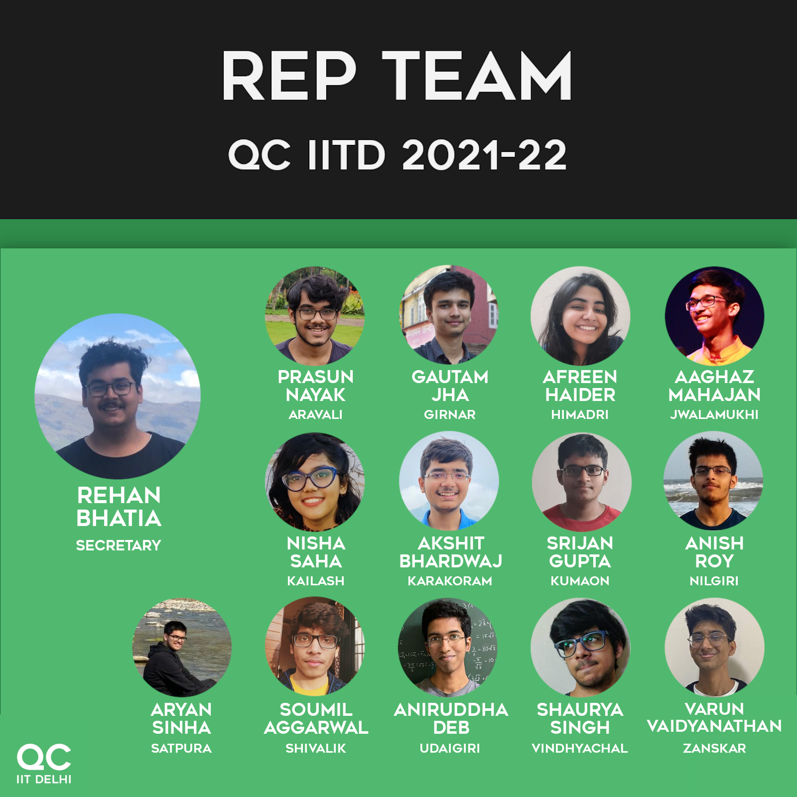

Title: Updates on Life in general
Date: 2021-08-14 21:20
Category: Writing
Tags: Writing
Slug: updates-on-life

I haven't done one of these in a year or so ([this was the previous one][1]), and neither have I written content exclusively for my blog for atleast a few months now, so it's a good time to do one of these because _a lot has changed in the past one year_. 

## Let's start with summer

The past two months have been amazing.

That doesn't even sum up just how great they've been.

I've done a lot of what I liked, some of what I didn't like, very little of what I hate, and everything made me a better individual. I realize that sounds straight out of the pages of a corporate brochure, but I promise it's the truth. Even though I stepped into summer without a concrete plan or project, I ended up accomplishing more than I expected, and even if you ignore all of that, I found some amazing things along the way.

## Now something concrete

The most concrete thing that pops out to me is my department change. Yes, everyone knew it was coming. Yes, **I** knew it was coming (so much so that I sat in the CS orientation rather than the MT orientation after the first semester), and Yes, I wasn't surprised when the official notification was finally sent out. 

> However, as every day goes by, I come to terms a bit more with the magnitude of what truly happened. Just because you know something significant will happen, it doesn't take the edge off the magnitude of your achievement, when it finally happens. You find it hard to stand stoically and claim "<span  style="font-size: 12pt;">अरे ये तो होना ही था</span>", and everyday, I still ponder in amazement when I open my inbox and it reads `cs1200869` rather than `mt6200869`, thinking 'damn. This happened'

This couldn't have happened without everyone else who was involved, and unlike JEE, this time I didn't do it sitting alone in my room. I did it in the midst of my friends, my hostelmates and everyone else at IIT Delhi, and seeing the congratulatory messages pour in when the results finally came in was breathtaking. Thank you to everyone I've met at IITD so far; you guys and gals have been amazing, and when campus reopens, I can't wait to spend the rest of whatever little time we have with you: playing, talking or just aimlessly wandering through our campus.

The next thing that happened is the elections; I'll probably write on this a bit more later, but the good part is that I'm a Quizzing Club representative now, as well as a convenor in Debating Society! Quizzing and Debating are two activites I really enjoyed doing in my first year, and it feels great to finally be more involved in both of them now. Looking forward to hosting more quizzes and adjudicating or tabulating more debates, rather than merely participating in quizzes or debates.

In terms of academic things, I attended the IBM [Qiskit Global Summer School in Quantum Computing][2] for two weeks in July, which was also a great experience. We received a crash course in quantum computing and quantum machine learning, supplemented by five amazing labs, all of which I really enjoyed doing. I am also pleased to be a [Reliance Foundation Scholar in Artificial Intelligence and Computer Sciences][3], the onboarding event for which is scheduled on the 19th of August. Finally, it was great attending the events and camps organized by those at IITD: The Summer of Competitive Programming by ANCC and the Summer of Machine Learning by AIMLC. Both of them were great learning opportunities; the latter giving rise to [MathSolver][5] (Article on that soon too, I promise).

## The little things

There weren't many of these that I can remember now, but I designed the Quizzing Club Introductory poster this time.

<center></center>

I also applied for the Board of Student Publications, the press arm of IIT Delhi, and they had a very interesting google form that we needed to fill to be shortlisted for an interview. I will be uploading my responses to that form soon enough, but I filled that out in the first week of August, and it was a fun exercise filling that in, because I hadn't written anything original in a long time.

As for Quizzing and Debating, I quizzed a lot and won nothing :P (best fresher, yes but that's a club award and not a quiz). the same goes for debating, except that I managed to break in my first external debate. The external debate was fun, albeit a bit exhausting. I need to get used to those :)

I did a bit of number theory and cryptography as well in the summers, learning what AES, RSA and all of those were. Some competitive programming was also on the list (<a id="codeforces" href="" style="font-family: helvetica neue,Helvetica,Arial,sans-serif; font-weight: 700; font-size: 12pt">aniruddha_deb</a> on CodeForces, [aniruddha_deb][4] on AtCoder), and I learnt a few more algorithms there. 

## What now?

The third semester is in full swing by now, and it's time to look beyond the horizon to further challenges. I'm enjoying all the computer courses so far, in spite of the several ominous warnings that seniors have given me, about CS being assignment hell (It's the first week, so I'll give them the benefit of doubt). Mathematics is also great (another article on some probability theory coming soon), and I'm trying to keep a healthy balance between everything else. 

I'd like to talk a bit more about onboarding and internships; I meditated long and hard on these two topics, and finally came to the nihilistic conclusion that in the short term, *both of them don't matter*. 

Regarding onboarding, seeing everyone meeting up and enjoying life simultaneously makes me happy and fills me with the fear of missing out. I'm not going to lie that it hurts at times to imagine myself in the pictures. However, that won't help at this stage. The conclusion I had reached with my parents was that it was too risky to onboard, and even though I had to see a lot of my friends go to campus, I've stood by that decision so far, and the workload of the new semester helps solidify that stand more. Nevertheless, doesn't matter now.

Regarding internships, first phase placements passed me by, and I was left wondering whether I made a mistake by not applying to them. Again, the result I reached on thinking a bit more was that second phase is always there, and if not that, I can always reach out and get internships on my own. Whatever decisions I took, I took them keeping in mind alternative actions, and it is pointless to question those decisions midway through their arc. Only after all the arrows have been shot and my quiver is empty, should I seriously question my decisions. Till then, sticking to them is my best bet.

In the larger perspective of things, both of these are inconsequential; I will inevitably be onboarded sooner or later, and I will inevitably get an internship, sooner or later. It's only the local minima that is preventing me from seeing the global maxima of the landscape of life, and this too shall pass. 

## Anything else?

Following the Qiskit summer school, I took a break from everything for a week or so. I was yearning for a holiday, and I hadn't had one in a long time, so I switched off WhatsApp for a week and connected with the world around me. This was a refreshing experience, and it was the only time in the summer vacations that I can honestly claim felt like a 'vacation'. Some might argue that's a bad thing, and I should relax more often; In my opinion, it was just right. All I did was sketch a bit, write some poetry, play some volleyball and sleep a lot, and life was good.

Anime! Yes, I watched a lot of anime. We had a clannad watchalong with friends, and I finished Steins;Gate on my own. What a show! I'm currently watching Code Geass, but that's proceeding at a snails' pace because <strike>I'm also watching the good doctor right now</strike> there's a lot of academic workload now. I also tried my hand at the clannad visual novel, but that's very slow again, so I play that occasionally.

Another thing was this [COVID vaccine analysis][6] that I did, as part of the joining assignment for a small startup from our campus. Even though that didn't happen, I learnt a lot from this assignment, and I'll write about it a bit more sometime (this is a recurring trend; I promise more articles than I actually write :P)

####(here's a bonus for you)

The CodeForces username badge uses a CF API request to change the color. This uses the CodeForces API to obtain the rank of the user, then adds that as a class, which the CSS then takes care of. Here's how it works:

```javascript
function getCFLink() {
	var req = new XMLHttpRequest();
	var cfId = document.getElementById("codeforces");
	var username = cfId.innerText;
	// yes, I should urlencode the usernames, but it works for now
	cfId.href = "https://codeforces.com/profile/" + username;
	req.addEventListener("load", () => {
		var reply = JSON.parse(req.responseText);
		if (reply.status === "OK") {
			var rank = reply.result[0].rank.replace(" ", "-");
			cfId.classList.add(rank);
		}
	});
	req.open("GET", "https://codeforces.com/api/user.info?handles="+username);
	req.send();
}
```

*The same cannot be done for AtCoder*, because neither does AtCoder have an API nor does it allow cross-origin requests, so the AtCoder badge would have to remain plain for now.

Thank you for reading so far, and stay tuned for what's to follow :)

[1]: https://aniruddhadeb.com/articles/2020/iit-delhi-mnc.html#iit-delhi-mnc
[2]: https://qiskit.org/events/summer-school/
[3]: https://scholarships.reliancefoundation.org/
[4]: https://atcoder.jp/users/aniruddha_deb
[5]: https://apps.aniruddhadeb.com/MathSolver
[6]: https://github.com/Aniruddha-Deb/strattech-intern-assignment

<link rel="stylesheet" type="text/css" href="styles/cftitles.css">
<script>

	function getCFLink() {
		var oReq = new XMLHttpRequest();
		var cfId = document.getElementById("codeforces");
		var username = cfId.innerText;
		cfId.href = "https://codeforces.com/profile/" + username;
		oReq.addEventListener("load", () => {
			var reply = JSON.parse(oReq.responseText);
			if (reply.status === "OK") {
				var rank = reply.result[0].rank.replace(" ", "-");
				cfId.classList.add(rank);
			}
		});
		oReq.open("GET", "https://codeforces.com/api/user.info?handles="+username);
		oReq.send();
	}

	/* Does not work because AtCoder does not allow cross-origin requests, F
	function getAtcoderLink() {
		var req = new XMLHttpRequest();
		var atcId = document.getElementById('atcoder');
		var username = atcId.innerText;
		atcId.href = "https://atcoder.jp/users" + username;

		const parser = new DOMParser();

		req.addEventListener("load", () => {
			var doc = parser.parseFromString(req.responseText);
			var span = doc.getElementsByClassName('user-red user-orange user-yellow user-blue user-cyan user-green user-brown user-gray user-unrated user-admin');
			atcId.classList.add(span.classList[0]);
		});
		req.open("GET", "https://atcoder.jp/users/"+username);
		req.send();		
	}*/

	getCFLink();

</script>
