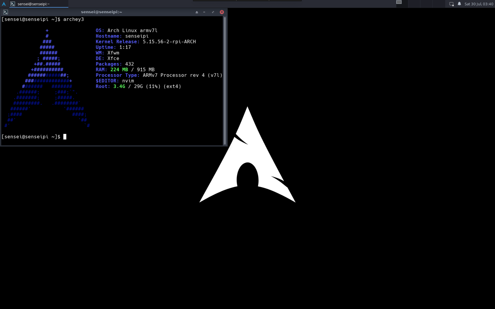

Title: The Arch Linux Journey
Date: 2022-08-07 15:30
Category: Programming
Tags: Arch, Programming, Linux
Slug: arch-linux-1

For the upcoming semesters, we have a ton of systems courses. So, I needed a linux box that I could hack around, preferably at the kernel level. I finally got around to installing Arch Linux on a Raspberry Pi<sup>1</sup>: Here's how I did it.

## Context

For starters, I already use linux/unix systems quite a bit. The real need for a linux system became apparent last semester, when one of our courses needed a program that would run only on Windows/Ubuntu. I got around this by running a VM on my 6 year old, 128GB mac _sobs_. While definetly a suboptimal solution, for the upcoming courses (networks, parallel programming, OS), a core linux machine would be a neccessity.

Before you pick up your pitchforks, yes, RPi is ARM based: I know this is a completely different ballgame from CISC i386/x86-64 processors, which is also partly the reason I wanted linux on an ARM machine: we did ARM assembly in the previous course, so that'll make this easier? <sub>idk I'm bad at CS</sub>

## Baby Steps


So why arch?<sup>2</sup> Well, the biggest reason is **learning**: learning to setup arch and use it would teach me more about UNIX fundamentals than using a prebuilt OS. And in the span of less than half a day, I've used atleast 6 utilities I've never seen or heard of before. So yeah, if you enjoy the hike a steep learning curve gives you, arch is perfect.

### Installation

Installation was fairly straightforward: NOOBS doesn't ship with an option to get arch, so [PINN](https://github.com/procount/pinn) was used. Remember to download it from GitHub rather than from SourceForge: SourceForge mirrors are garbage, while the GitHub one downloads in under a minute.

After getting PINN, just point-and-click to install arch.

And that's it!

## Btw I use arch

Ok, I lied. Arch ships with nothing, and I mean _nothing_ 

* No windowing server
* No desktop environment (by extension)
* No setup screen

All these are forgiveable (and quite common on server distros), but then we have:

* No man pages. Seriously?
* No `sudo`
* No keychains set up
* No drivers for Bluetooth, or Wifi set up

Fortunately, the ARM arch ships with a few more things: `netctl`, `X11`, and wifi drivers. And a SSH server running by default. The best way of setting up is to connect to your router via ethernet, then do an `arp-scan --localnet` (on mac, install with `brew install arp-scan`) to find the ip, ssh on, and get rolling (default user `alarm`, password `alarm` and root password is just `root`)

### Connecting and basics

- Plug in your Pi to ethernet, and use your WiFi router settings page to see all connected devices. From there, note down your pi's IP and ssh on to it. 
- use `timedatectl` to see if the system clock is accurate:
```
timedatectl set-ntp true
```
use `timedatectl status` for information.
- Set up the timezone:
```
ln -sf /usr/share/zoneinfo/Asia/Kolkata /etc/localtime
hwclock --systohc
```
- generating locales: edit `/etc/locale.gen` and uncomment `en_US.UTF-8`. Generate locales by running `locale-gen`. Then, create the `locale.conf` file and set `LANG` appropriately (I set it to `en_US.UTF-8`)
- Edit the hostname from `alarmpi` to something better, like `senseipi` :)

### Setting up `pacman` and certificates

Now that you're on the pi with a connection, the first thing to do is to setup `pacman`. This needs certificates: since Arch is a rolling distro, there's a very rigorous signature process in place for packages, and the system by default won't install packages which are not signed by trusted certificates in the keychain. 

Setting this up on ARM is slightly different compared to a normal arch system (or so I found):
```
pacman-key --init
pacman-key --populate archlinuxarm
pacman-key --refresh-keys
```

After that, `pacman -Syy` and `pacman -S archlinux-keyring`. Will install a couple dependencies as well.

You're now ready to run
```
pacman -Syu
```
to update and upgrade everything on your system.

### Wifi setup
Just use `wifi-menu`, don't bother with anything more complicated. You'll also need to create a service to start wifi automatically on boot, by doing:
```
systemctl enable wpa_supplicant@wlan0
systemctl start wpa_supplicant@wlan0
```

After this and rebooting, I was able to ssh onto my pi, by connecting it to my mobile hotspot. This is still my primary means of using my Pi. One important thing to note: **Don't try switching to NetworkManager without a working display and ethernet connection**. I tried doing this, only to blow the network setup on my Pi, because once you set up the NetworkManager service, it would take over `wlan0` on boot and because it didn't know the wifi configuration, it would never connect to the network, so I couldn't SSH/VNC onto it. After a lot of repeated tries, `wpa_supplicant` finally launched before NetworkManager on one boot, allowing me to ssh on and disable NetworkManager for good.

### Users, `sudo` and User Groups
- Create your new user
- ssh on as your new user, and su to root
- delete the old user
- install sudo: `pacman -S sudo`
- `visudo` the sudoers file to give the wheel group access to sudo
- add your user to the wheel group
- run `id <username>` to verify you're added to the right groups

### Other software
- utilities: `sudo pacman -S man-db man-pages nvim htop tree`
    - run `mandb` to generate the man database
    - `export EDITOR=nvim` in your `.bashrc`
- yay
    - install git: `sudo pacman -S git`
    - go to /opt
    - clone [https://aur.archlinux.org/yay.git](https://aur.archlinux.org/yay.git) there
        - needed to set a proxy for this: `git config --global http.proxy ""`
    - chown to our user
    - make the package with `makepkg -si`
    - had to install base-devel for this: `sudo pacman -S base-devel` (install everything, most of them are useful)
        - go was not installing, surprisingly go-2:1.19-1 was updated on Aug 3 itself and I hadn't done `pacman -Syy`Reiterated the importance of keeping my package lists updated in a rolling release distro.
        - `makepkg` was surprisingly straightforward thereafter
    - add colors:
        - `sudo nvim /etc/pacman.conf`, uncomment the Color line
- GUI stuff
    - installing fonts
        - `yay -S ttf-roboto ttf-opensans ttf-roboto-mono ttf-ubuntu-font-family ttf-dejavu ttf-hack ttf-liberation`
    - install Xorg stuff
        - `yay -S xorg-server xorg-xrefresh` (install libglvnd)
        - `yay -S xorg` (install everything)
        - `yay -S xterm`
        - `yay -S xfce4`
        - `yay -S arc-gtk-theme arc-icon-theme`
- TigerVNC
    - `yay -S tigervnc`
    - edit your vnc config and set a vnc password with `vncpasswd`, then run `vncserver`. Also, add this as a system service so that it starts on boot

## To come

Congratulations: if you don't have a working system by now, atleasy you would have enough confidence to take your system in the direction you want to take it now. Here's a snap of how mine looks like after I was done with setup:



## References

1. [Arch Linux Installation guide](https://wiki.archlinux.org/title/installation_guide)
2. [Arch Linux General Recommendations](https://wiki.archlinux.org/title/installation_guide)
3. [Gist on RPi Arch setup](https://gist.github.com/TheZoc/849a82d3eed219998cd82fb4040607ae)
4. [Instructable on Arch on RPi](https://www.instructables.com/Arch-Linux-on-Raspberry-Pi/)
5. Too many arch linux forums threads to count.

## Footnotes

<sup>1</sup> Finally, a tech article! Reading the previous articles, it personally seemed a bit sad that what started out as a STEM blog is now basically me masquerading as Kalpit Veerwal or some armchair IITian celebrity, sans the obnoxious YouTube channel (the most viewed article on this blog is my JEE journey :'( ) This sucks, but is easily changeable. Since I write about what I do, the solution is to just do more tech :P 

<sup>2</sup> In the middle of intern interview season and wrapping up my SURA, only a masochist would do this to himself