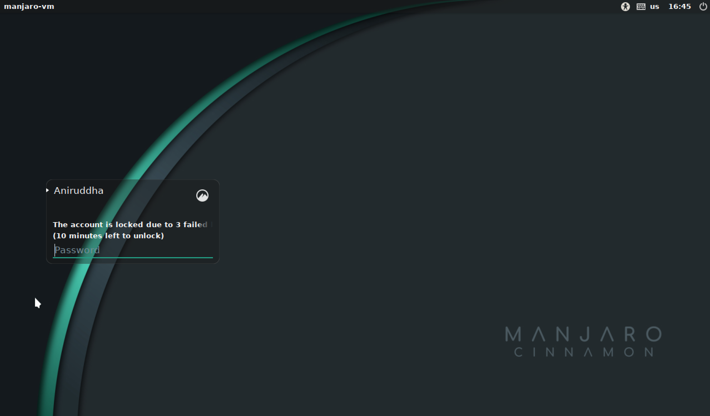

Title: Bootloader Deep Dive
Date: 2022-12-03 05:00
Category: Programming
Tags: Programming
Slug: boot-deep-dive

## The Basics

The most basic boot process is BIOS on a standard i386/x86-64 device. The BIOS
first detects the CPU/RAM, then initializes the remainder of the hardware, and
then begins the boot sequence. The boot sequence basically consists of finding 
a bootable device, loading the boot program in that bootable device into the 
processor cache and letting the processor do it's thing.

How is a bootable device found? A device is considered bootable if it has the 
magic bytes `0x55` and `0xaa` at offsets 511 and 512 from the start. This block
is called the _boot block_ or _master boot record_ (MBR), and this is what
kicks off the boot process. 

The MBR looks something like this: 
```shell
[sensei@manjaro-vm temp]$ sudo dd if=/dev/sda of=mbr.bin bs=512 count=1
1+0 records in
1+0 records out
512 bytes copied, 0.00493179 s, 104 kB/s
[sensei@manjaro-vm temp]$ hexdump mbr.bin 
0000000 63eb 0090 0000 0000 0000 0000 0000 0000
0000010 0000 0000 0000 0000 0000 0000 0000 0000
*
0000050 0000 0000 0000 0000 0000 8000 0001 0000
0000060 0000 0000 faff 9090 c2f6 7480 f605 70c2
...
...
00001c0 0021 fe83 ffff 0800 0000 f026 01df 0000
00001d0 0000 0000 0000 0000 0000 0000 0000 0000
*
00001f0 0000 0000 0000 0000 0000 0000 0000 aa55
```

`dd` copies the first 512 bytes of my disk to a binary called `mbr.bin`, and 
we hexdump it's contents. Note the `0x55` and `0xaa` magic bytes right at the 
end (the system is little endian, so it reads as `aa55`). These 512 bytes tell 
the system to load in GRUB, which then begins the boot process.

## GRUB

The GRand Unified Bootloader is the default bootloader on Linux systems. What 
GRUB does is create a basic runtime, initializes the ramdisk and finally loads 
the kernel in. GRUB is launched by those 512 bytes that we saw above. The
actual GRUB files are stored in `/boot/grub`, and they look like this:

```shell
/boot/grub
├── fonts
│   └── unicode.pf2
├── grub.cfg
├── grubenv
├── i386-pc
│   ├── acpi.mod
│   ├── adler32.mod
│   │   ...
│   │   ...
│   └── zstd.mod
├── locale
│   ├── ast.mo
│   ├── ca.mo
│   │   ...
│   │   ...
│   └── zh_TW.mo
└── themes
    └── starfield
        ├── blob_w.png
        │   ...
        │   ...
        └── theme.txt
```

What GRUB does is essentially create a 'mini 32-bit linux OS', with debug
environments, a shell, and a lot of creature comforts, but beyond all that, it 
creates the RAMFS and loads the kernel and points it to the RAMFS. This can be 
seen in the `grub.cfg` file:

```shell
menuentry 'Manjaro Linux' --class manjaro --class gnu-linux --class gnu --class os $menuentry_id_option 'gnulinux-simple-ffd2d1d7-a3e5-4e24-816d-d83f13c56708' {
    savedefault
    load_video
    ...
    ...
    linux	/boot/vmlinuz-5.15-x86_64 root=UUID=ffd2d1d7-a3e5-4e24-816d-d83f13c56708 rw  quiet udev.log_priority=3
    initrd	/boot/intel-ucode.img /boot/initramfs-5.15-x86_64.img
}
```

Note the last two lines: here we're specifying the actual linux kernel image
using the `linux` command, and the files that initialize the RAMFS using `initrd`.
(The `intel-ucode.img` is a bunch of microcode patches that the OS loads in to 
workaround hardware-level bugs, think heartbleed, spectre etc. It's super 
important to load this in before anything else, so that the boot process may 
not be compromised and so on.)

## What's a RAMFS

A RAM file system (or RAM disk) is, quite simply, a file system in memory! When 
the system needs to boot, the files for the system may not simply be on the 
HDD/SSD: they can be somewhere on the network (PXE boot), on a removable media 
(USB,CDROM) or on an encrypted drive! (BootLocker equivalents on Linux). For 
all this, we need a temporary file system that the kernel can run off of to
load the OS into actual memory.

Another reason for a RAMFS is that the Linux kernel is neither monolithic, nor 
a microkernel: it's somewhere in between in the sense that you can load modules 
into the kernel while it's running. To do the stuff that we've described above,
(Boot off of the network, decrypt an encrypted drive, etc), the relevant kernel 
modules will need to be loaded into the kernel first. These generally reside in 
the initramfs image, and are loaded into memory by the kernel. `initramfs` is 
generally a `cpio` compressed image, which is decompressed when it's loaded in 
(something that GRUB does), and this is generated using the `mkinitcpio` command, 
after specifying the default modules and hooks (for more information, check 
out [This great resource](https://nickdesaulniers.github.io/blog/2018/10/24/booting-a-custom-linux-kernel-in-qemu-and-debugging-it-with-gdb/)
which boots a Linux Kernel from scratch in QEMU)

## From Kernel to Login Screen

Once the Kernel has finally loaded all the modules from the RAMFS and entrenched 
itself in memory, it calls `/init` in the RAMFS to finally load the disk and 
all other modules from disk.

It's all downhill from here: once all modules have been loaded, `systemd` (or 
[Your favourite Init Daemon](https://nosystemd.org/)) is called, which starts 
as PID 1 and spawns all relevant processes on the system. `systemd` will then 
start LightDM (On Manjaro, you might have a different Desktop Manager), which 
displays your login prompt, and you can now finally login!



Unless, of course, you've locked yourself out with too many failed password 
attempts

## Is this process standard across systems?

Nope. Atleast, not when you change architectures. Or go to UEFI. Ah, let's just 
say this is very specific.

I bumped into this whole process as I wanted to do some kernel hacking on my 
faithful [Raspberry Pi](https://aniruddhadeb.com/articles/2022/arch-linux-1.html).
I regret to inform all Pi hackers that the bootloader process for the Pi is 
[completely different](https://raspberrypi.stackexchange.com/questions/10442/what-is-the-boot-sequence/10595#10595),
and much easier, and all you have to do is place your kernel image with the 
appropriate name in the '/boot' directory and the Pi will boot from it.

TL;DR the Pi has a two (three?) stage bootloader, which curiously completely 
runs on the GPU. The only time the CPU is actually used is when the kernel image 
is loaded into memory, and the actual init process starts. The bootloaders are 
`.elf` files, and are apparently proprietrary. I'll give decompiling them a 
shot if I have free time, but I think someone would already have tried that out.

On a side note, embedded systems with limited memory and a fairly fixed device 
layout generally boot without a RAMFS, as there's simply no need to hotload a 
bunch of modules into the linux kernel, when you know exactly what modules you'll 
need and what the hardware arrangement (where you're going to boot from) is.

Happy Hacking!

