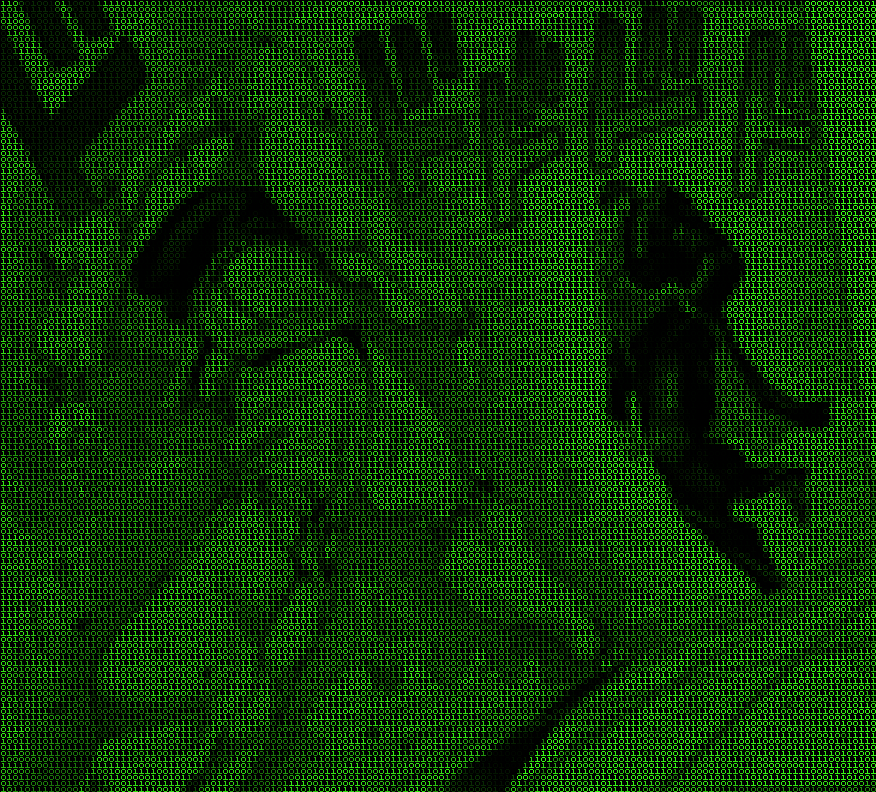
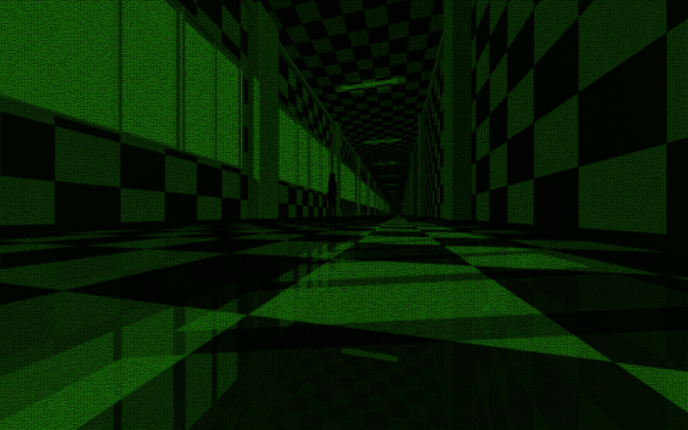

Some of you might have come across [HackerFX](https://github.com/Aniruddha-Deb/HackerFX),
an image binarizer. This was written a long time back, when the only language I 
knew was Java, and when I was still in school. 

An update was on the cards for a while, because I wanted to change my desktop 
background (which still looks surprisingly pretty for something made so long 
ago). I started playing around with PIL today evening to update this, and the 
end result is [HackerFX v2](https://github.com/Aniruddha-Deb/hackerfx-v2), a 
python rewrite that supports multicoloured input images, hex, file dumps, 
variable colors and a manual 5x5 font for the output charactes (so the aspect 
ratio doesn't have to be manually tweaked). It's a step jump in every way, and 
the images it generates are super pretty

Especially with hi-res shots, you have to zoom in to tell the difference. The 
performance is also very cool, given that you're iterating over millions of 
pixels. This does it all in less than 10 seconds.

More examples are there in the github repo, and I haven't played around with 
the options much to generate prettier ones (it's getting kind of late, should sleep).
Feel free to clone the code, give it a spin on your images and enter the matrix :)

**UPDATE**: Thanks to [Salil](https://github.com/Salil03) for implementing this 
for videos, and improvements to make video processing faster/better 
(multithreading, bitstream pre-generation, etc). Here's the result:

<iframe width="560" height="315" src="https://www.youtube.com/embed/O16AXOghFd8" title="YouTube video player" frameborder="0" allow="accelerometer; autoplay; clipboard-write; encrypted-media; gyroscope; picture-in-picture" allowfullscreen></iframe>
