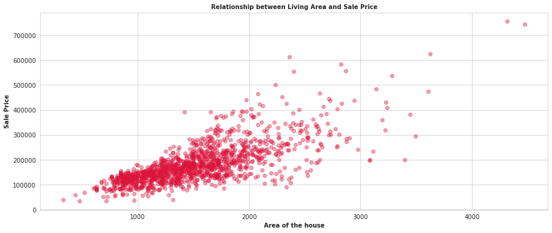
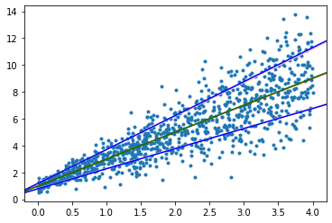

## Motivation

Most linear regression models assume 

$$y^{i} \approx \mathcal{N}(\theta^T x^{i}, \sigma^2)$$

The standard closed form for this, obtained via finding the MLE estimate, gives $(X^T X)^{-1} X^T Y$, where $X$ is the example matrix of shape $(m,n)$ and $Y$ is the label vector of shape $(n,1)$. Note that $m$ is the number of training examples and $n$ is the number of features.

However, the variance need not always be constant. Consider a model where the variance is varying linearly (or rather just increasing) with $x$: an example would be the [House prices dataset](https://www.kaggle.com/code/chanakyavivekkapoor/house-price-prediction)

While there are feature transformations that would make this less heteroscedastic, this article focuses on learning the variance parameters, so along with our regression estimate, we can provide a variance estimate as well

## The Model

We assume that the **standard deviation** (not variance) is a linear function of $x$

$$y^{i} \approx \mathcal{N}(\theta_m^T x^{i}, (\theta_v^T x^{i})^2)$$

The log-likelihood function is hence

$$\mathcal{LL}(\theta_m, \theta_v) = -\frac{m}{2} \log 2\pi - \sum_{i=1}^m \log \theta_v^T x^{i} - \frac{1}{2} \sum_{i=1}^m \frac{(y^{i} - \theta_m^T x^{i})^2}{(\theta_v^T x^{i})^2}$$

Differentiating with respect to $\theta_v$ gives us the gradient for $\theta_v$:

$$\frac{\partial \mathcal{LL}}{\partial \theta_v} = - \sum_{i=1}^m \frac{x^{i}}{\theta_v^T x^{i}} + \sum_{i=1}^m x^{i} \frac{(y^{i} - \theta_m^T x^{i})^2}{(\theta_v^T x^{i})^3}$$

Rearranging this gives us, in a matrix form,

$$\frac{\partial \mathcal{LL}}{\partial \theta_v}= X^T \left( \frac{E^2 - S^2}{S^3} \right)$$

Where $X$ is our example matrix, $E$ is the sum of squared error vector and $S$ is the standard deviation vector. This is a nice, concise form that we can use in our code. However, because of the $V$ term in the denominator, **I couldn't obtain a closed form for this, and had to do gradient descent on the parameters**. Even getting into second derivative methods was getting a bit tedious. If you do find a closed form, let me know :)

The derivative with respect to $\theta_m$ is pretty standard: we get

$$\frac{\partial \mathcal{LL}}{\partial \theta_m} = \sum_{i=1}^m x^{i} \frac{(y^{i} - \theta_m^T x^{i})}{(\theta_v^T x^{i})^2}$$

## An Implementation

Implementation was fairly straightforward, using gradient descent, and it converged nicely to some generated data

