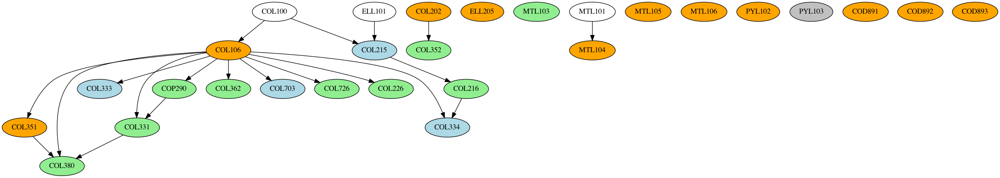
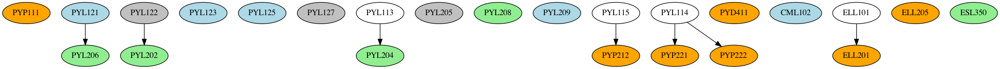
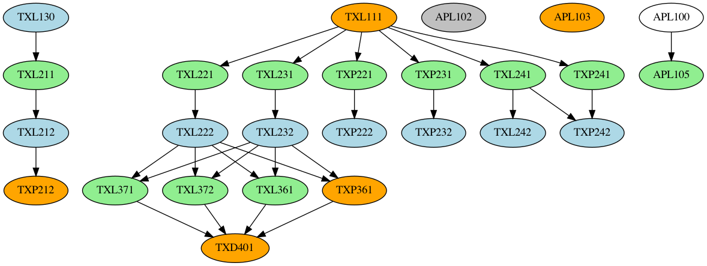

I seldom get time to do anything other than course related activities nowadays, but in this midsem break, I did nothing other than roam around campus and laze in bed. And publish the first release of the [IIT Delhi Course Planner Dataset](https://kaggle.com/aniruddhadeb/iitd-course-data) (Also available on [GitHub](https://github.com/Aniruddha-Deb/IIT_course_planner)). This is a scraping of the [IIT Delhi Courses of Study 2020-21](https://home.iitd.ac.in/uploads/Courses-of-Study_2020-2021.pdf), a behemoth 373-page PDF, which contains the course structure and information of all the Undergraduate and Postgraduate courses offered at IIT Delhi, and then some more. In this article, I show how I went from an inaccessible PDF to a set of nicely formatted XML/CSV datasets that anyone can use to do course analysis on the courses at offer here.

## Context (for those not at/from/new to IITD)

The Academic System at IITD is pretty similar to those followed in other IIT's (except Kanpur): grading is done on a grade point system (10 for an A, 9 for an A- and so on), and your CGPA (Cumulative Grade Point Average) is the average of all your grades across all your courses you have taken up to that point. 

Coming to Programmes: there are 13 Undergraduate Degree Programmes on offer at IIT Delhi (14 if you count Energy Engineering, introduced this year) which span four years and eight semesters, and 3 Dual Degree Programmes (Bachelors and Masters combined), which span 5 years and 10 semesters. Programmes are denoted by a two-letter code representing the departments offering the course, and a number representing the type of course (eg CS1 is B.Tech in Computer Science and Engineering (4y), CS5 is Dual Degree (B.Tech + M.Tech) in Computer Science and Engineering (5y)). Most 4 year degrees are suffixed with 1 (notable exceptions ME2 and EE3, because ME1 and EE1 are already offered by the departments), and the dual degree programmes are CS5, MT6 and CH7 (all greater than or equal to 5).

Each programme has a number of courses that you NEED to do to graduate: these are referred to as your core courses. They're divided into two: institute core and department core. Institute core is a common set of courses people from every department do, mostly in their first year (exception CVL100 and SBL100), and department core is what makes up the bulk of the remaining three (two?) years of your degree. The rest of your degree is comprised of Humanities and Social Sciences (yes, sad), which you need to do 15 credits worth, and Electives, both departmental (picking electives from your department), and open (picking electives from any department<sup>2</sup>). If you're in a Dual Degree, your M.Tech degree would have it's own program core (some extra high-level courses and a M.Tech Project) and program electives.

Here's a relevant snap from the Courses of Study (henceforth referred to as CoS), showing how the courses shape up for MT1 (B.Tech in Mathematics and Computing) and MT6 (Dual Degree in Mathematics and Computing)

<center>
</img>
</img>
</center>

We'll be using these abbreviations very commonly across the article (`bs`,`eas`,`huss`,`dc`,`de`,`oc`,`pc`,`pe`), so this is a good point to mark and come back to. If a lot of this is still unclear, the CoS makes it much clearer than I do. Do give the first few pages of it a read. It's not as boring as expected. Promise. 

## Getting Started

I've wanted to do this from a long time, but never had the expertise or the effort to see this through. I've had some experience scraping PDF-Tabulated data using Tabula (my [JEE 2019 dataset](https://www.kaggle.com/aniruddhadeb/jee-2019-data)), but never really gotten farther and analysed the data<sup>1</sup>.

The first course of action was to scrape as many courses out as I could from CoS, because that contains course overlap/prerequisite information. The general course description across departments is given from page 156 onwards of CoS, and the way of scraping this was interesting: since the data was unstructured, all I did was copy and paste all the text into sublime text, then use macros to filter out the data and get it into a nice XML format. This took me around two-three hours. I was then able to parse it down using BeautifulSoup into a pandas dataframe, so mission accomplished there. The schema is pretty simple, and here's an example of what a course looks like
```xml
<course>
  <code>APL100</code>
  <name>Engineering Mechanics</name>
  <credits>4</credits>
  <credit-structure>3-1-0</credit-structure>
  <description>Kinematics, Statics, Equations of Motion, Rigid body dynamics, 
  Introduction to variational mechanics.</description>
</course>
```

A question asked here: **Why XML?** The major reason is that JSON does not play well with newlines, and a lot of the course descriptions had newline characters in them, and I didn't want to go through the mess of cleaning all that up, hence XML. I get that if I just wanted some lists and objects, I should have gone with JSON, but XML being tag-based is very easy to write using sublime multicursor, and also very forgiving with parsers like BeautifulSoup, allowing for messy data to exist and not outright breaking the parser.

This dataset is what is currently used in [IITD-Bot's `info` command](https://github.com/as1605/IITD-Bot), and it's nice to see it being used on the server :) 

## The Trickier Bits

We now come to the problem of scraping and formatting the individual course plans themselves: [Tabula](https://tabula.technology/) (specifically [TabulaPy](https://tabula-py.readthedocs.io/en/latest/)) is the best fit for stuff like this, but the problem here is that **The table boundaries and dimensions across courses are not the same!** Here's an example, showing two programmes overlapping each other and how the content dimensions/boundaries are not the same across programmes (CS1 and MT1)


Even for courses where there is significant overlap, the structures need not be same (consider EE1 and MT1, the first section lines up perfectly, but further sections are a mess: EE1 ends in half the page, while MT fills it up with it's electives)


Another issue was that as previously mentioned, Dual Degree course structures have two parts to them: a B.Tech part and an M.Tech part, and scraping them along with the Bachelor degrees would lead to major issues 


As a result, the best option I could come up with was to simply use some python code to generate most of the course structure. The Institute core is common across all courses: the only things that change across courses are PL,DC,DE,credit structure and recommended structure. Out of these, credit structure and recommended structure can be scraped without much pain. PL,DC,DE need to be manually scraped using good 'ol `Cmd-C Cmd-V` and edited and pasted using sublime text (multi cursors ftw here). I couldn't come up with a faster way than this due to the nonuniformity of the structure across pages, but it works.

For dual degrees, I simply duplicated the corresponding single degree and used some helper code to generate the recommended structure, pasted that in and entered the rest using the same sublime ninja techniques as before

## Course-Sem Mapping and Anonymizing Data

While we have the dependencies in place, the last piece of the puzzle is avoiding conflicts while scheduling courses. For this, we need to ask the following two questions:

1. Is a particular course available in a particular semester?
2. If it is, which slot is the course available in?

Answering these two will take us towards a validity checking algorithm for a given course structure. By course structure, we mean an arrangement of courses of the programme in semesters. A valid course structure is one that:

1. Has no course taken whose prerequisites are not satisfied 
2. Has no course taken in a semester where it is not offered
3. Has no course clashing with another course i.e. occuring in the same slot in the same semester as the other course

For this, we need course slotting and semester data, which the courses of study does not offer. We turn to the eacademics portal of IIT Delhi, which offers a list of courses offered in a given semester, which contains slotting data. While the raw courses offered list can be downloaded in a variety of formats, it needs a _lot_ of preprocessing to get it fixed. So far, the best option is to download it in xlsx, use a python xlsx library to delete all the extraneous columns in the file and then save it as a CSV. 

We now come to the concern of Privacy. The course list has the names and email addresses of the professors offering the course, and making that data public is not something I should do. As a result, before making the dataset public, the professor data needs to be anonymized. I used faker for this, but was unhappy with how the emails and names don't quite correlate with each other, even while making user profiles. There may be two professors having the same name (eg [here](https://web.iitd.ac.in/~abhishek.dixit/home.html) and [here](https://web.iitd.ac.in/~adixit/)), so the key trick is to use the email address prefix, also called the kerberos ID (`<id>@<department>.iitd.ac.in`), which is guaranteed to be unique. Once this is done, retain the mapping across sheets and also save a copy of the mapping as a csv (in a private place) so that we can dereference the professors if needed.

## Final Analysis and Dependency Graph Generation

We are now ready to combine the course-offered slotting, the courses of study data (gives us prerequisites), and the course structure (gives us the courses to consider), and create a basic dependency graph.

The first order of action is to load the CoS course data into XML, and generate a few extra colums so that we know which semster the course is offered in (here, a 3 implies offered in both semesters, a 2 in the even semester only, and a 1 in the odd semester only. 0 implies that it was not offered in either semster in this academic year)


After this, we read in the course dependency XML files, and generate the dependency graphs using NetworkX and the data in the course dataframe. A generic NetworkX graph does not space the nodes out properly, which is why we use NetworkX and pydot (a python GraphViz API) to generate the final PNG files. The final result, is indeed quite pretty


## What Next?

Right now, there are two major gripes relating to conditional support:

1. **Handling complex conditionals for courses**: The CS1 course structure is a perfect example of this. One can choose either COL333/COL362 in their core, and the other as department elective. We need a way of representing this in the graph, as well as in the XML (what I had in mind was to use an `<or>...</or>` tag, this would work in any setting, and using dotted lines in the graph). The or tag would also be used in the CS1 PL courses (one of MTL103/4/5), because at the moment, the graph shows all three of them as requisite. There are a few other conditionals for CS1 regarding Minor, but we'll get to that later
2. **Conditional expressions**: Prerequisites often have conditionals such as "ABC123 and any one of BCD142/BCD143/BCD144" or in the case of HUL courses, the condition is "Any two courses from HUL2XX category". Handling conditionals like this both in the dataset as well as in the resulting graph (using dotted arrows or other means) needs to be worked on.

The dataset also doesn't cover all facets of the courses of study:

3. **Minor Dataset Addition**: Datasets for minors/department specializations need to be added
4. **Energy Sciences**: ES1 course data needs to be added. Would be easily fixed by shifting to CoS 21-22 but I'm not sure how many things that would break in the PDF scraping section

I've hardly mentioned the problems in the existing dataset: there are still a lot of broken tags in the courses XML dataset that need to be ironed out, and not to mention the bugs that exist in the CoS itself (MT1 courses don't sum up to 63.5 credits because some 700 level courses mentioned in the schedule but not in text are missing, and these courses also don't have a description of their content or prerequisites anywhere in CoS).

The good thing about stating problems out here is *We Need Contributors!* If you think you can make a change and help fix those bugs, or even go ahead and do something completely different with all the useful data here, do fork the [GitHub Repo](https://github.com/Aniruddha-Deb/IIT_course_planner.git) and submit a PR for your fixes.

I will keep making more blogs as I (or others) continute to contribute and work towards making a concrete portal out of this. Let's see where this journey leads!

## Appendix: Course Dependency Graphs

(Orange => offered in both sems, green => even sem only, blue => odd sem only, gray => no sem slotting info available)

AM1: 

BB1: 

CE1: 

CH1: 

CH7: 

CS1: 

CS5: 

EE1: 

EE3: 

ME1: 

ME2: 

MS1: 

MT1: 

MT6: 

PH1: 

TT1: 

-------

_This is Part 1 of a series documenting the development of IIT Course Planner: a set of tools and utilities to help plan your course at IIT Delhi_

<sup>1</sup>The analysis I had in mind was to make a ranking of the various departments on offer, then use a standard matching algorithm to match users to departments (basically offer the highest-ranked course available to the user). The simpler first idea was to use a multiparametric regression model to fit ranks to courses. Neither of these ideas flew, because a) [The JoSAA allocation algorithm is amazingly sophisticated](https://arxiv.org/pdf/1904.06698.pdf), and b) the data does not map sex/caste to roll number, which would break any regression/ranking model I could think of. Still looking for a clever workaround for this one.

<sup>2</sup>Most people use this to boost their CGPA <sub>coughs in RDL,ASL and MSL</sub>.Welp, gotta keep that boat afloat, or rather _satti nahi thukni chahiye_.
