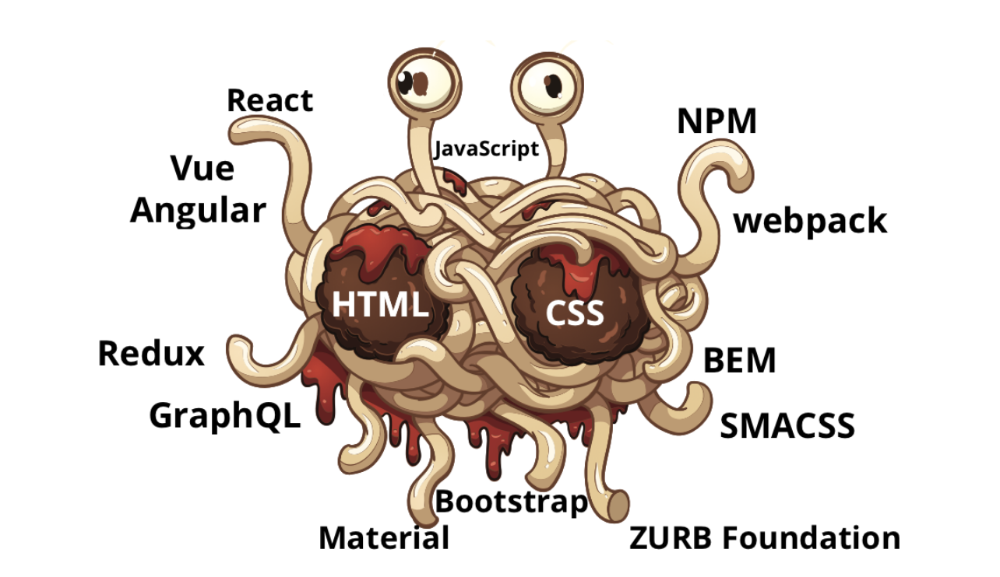
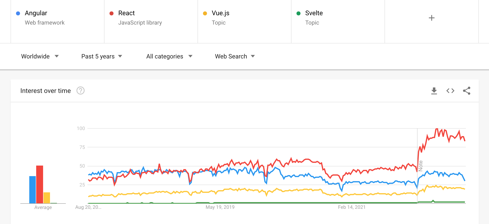

Title: The Rise of the Codefluencer
Date: 2022-08-20 17:00
Category: Programming
Tags: Programming
Slug: rise-of-codefluencer
Summary: My Thoughts on Web Development, Programming Influencers/tutors and the portrayal of programming as a lavish dream rather than providing a careful solution to complex problems, bit by bit.

Not an opinion piece, but an opinion piece. If it matters; what weight do the opinions of a twentysomething university student have on a trillion-dollar industry? This'll probably be something I'll look back at in twenty years and chuckle at my hotheadedness (if I'm alive after twenty years and have not evaporated due to climate change)

## Web Development, to an outsider

I recently had to develop a small platform to keep track of my investments. As luck would have it, I want this to be cross-platform, run in the background and send alerts to me on certain triggers. Which means No Desktop apps: XCode is out of the question because I don't have much expertise in swift, and I hopped off the Java bandwagon a long time ago. Most importantly, my laptop won't be running 24x7. So, create a python utility and a cron job, and run it? Sure, but I'd need a way to look at my portfolio as well, which doesn't involve a curses-based TUI. 

_sigh. You can probably tell where this is going._

Yep. We're finally doing WebDev. 

### The descent into darkness

I know the bare minimum about frontend frameworks (maybe a bit more conceptually), but have 0 practical experience. All my frontend so far has been bare HTML/CSS/JS, raw DOM manipulation, JS classes and no components (I felt the pinch a bit [In my previous project](https://github.com/Aniruddha-Deb/RubiksCube), but made do without it). This time though, I had to make a large Single Page Application<a href="#footnote-1">1</a> and component-wise design would be crucial.

I picked up [Vue](https://vuejs.org), and credit where it's due, Vue is probably the most beginner-friendly framework: good documentation, great conceptual clarity and nice examples. I'm good with [Flask](https://flask.palletsprojects.com/en/2.2.x/) as well, and it was easy to do some groundwork and housekeeping and set up a basic system supporting configuration, logging and authentication on the backend and routing and a couple views on the frontend<a href="#footnote-2">2</a>. Also, the Flask and Vite development servers run on different ports, so had to set up a reverse proxy on the Vite server to redirect API traffic to flask, which made it very _clean_ to run in debug mode, with both hot-reloading ^\_^. The next day (today), I added some CSS using [Tailwind](https://tailwindcss.com/), along with a login and registration page. 

With this done, the problems left to solve are:

- Connecting to my broker, getting quotes every 5 minutes and updating the database
- Creating a Pivot Table component from scratch to sum up the securities and all the transactions that have occured
- Packaging and deploying to a remote server (maybe heroku?)

These are still not _core_ engineering problems, and I probably will run into some when I work on making the daemon, and interfacing it with Flask and the DB. However, these are still more complicated than everything I've set up so far.

Seems simple enough, right? So where's the disappointment?

## Willy Wonka's Chocolate Factory

I simplified the description of the framework picking process **by a huge margin**. A simple google search for `frontend framework` returns 6 different sites<a href="#footnote-3">3</a> all listing the same top 10 (or 15) frontend frameworks, which are:

- React
- Vue
- Angular
- Backbone
- Bootstrap
- Foundation
- Svelte
- Elm
- Ember
- jQuery (yes, jQuery)

And here's the catch: all of them are used on the frontend in the same way, but it's the equivalent of googling _fruits_ and getting a list that says 

- Banana
- Watermelon
- Tomato
- Cauliflower
- Strawberry
- Apple
- Potato
- Sweet Potato
- Cucumber

Get the point? Half of these aren't even fruits!

- Svelte and Elm are compilers: you write code in their own Domain Specific Language (Svelte is pretty similar to JS, Elm is functional and actually quite nice on it's own, but too much of a toy to use in anything serious because it's a pain in the ass to interface with other JS libraries), and the compiler will compile it to JS. That's how these tout their _speed_
- Backbone seems to be doing something completely different and minimalistic: it still implements a MVC, but in a radically different way to how everyone else seems to be doing it
- jQuery is raw DOM manipulation, just a bit simpler, and _very_ antiquated: it used to be all the rage back in the late 2000's. `$` has now been relegated to the same scrap heap where PHP<a href="#footnote-4">4</a> and Microsoft Clippy reside.
- Bootstrap and Foundation aren't even full-fledged DOM manipulators, they just provide a set of components that you have to link together manually. Bootstrap started off as a plain CSS tool, and their components also feel like simple CSS trinkets rather than actual, extendable resources
- Finally, React, Vue, Angular and Ember are all virtual DOM manipulators: they maintain a virtual DOM, diff it with the real DOM when the elements in question have changed and render it to the screen. They com

And this is just the tip of the iceberg! WebDev today is a hodgepodge of different tools, different best practices and different, but very similar ways of solving the exact same problem! There is conceptually zero difference between what React, Vue, Angular and Ember do, but all of them have their own opinionated best practices:

- React uses JSX, which is an absolute eyesore: who at Facebook looked at HTML and JS and thought, 'let's convince them to have a baby!' Tywin Lannister would be proud.
- Angular and Vue use their own templating languages, which makes them not much different from react
- Ember.. I have no idea what ember does, but the only thing I've heard is that it has a very steep learning curve.

This gives rise to an entire army of touts whose livelihood is based on writing articles such as [Why React is better than Vue](https://blog.cloudboost.io/why-react-is-better-than-vue-js-and-when-9545049652d8)<a href="#footnote-5">5</a>, or [Why Frontend Development is a Mess](https://aniruddhadeb.com/articles/2022/rise-of-codefluencer.html)<a href="#footnote-6">6</a>. Every single article of theirs must include the obligatory Google Search Trends snap, showing how _Oh, the framework we're touting is the best!_ or how _Oh, look at this mess! Deplorable!_

Jokes aside, let's talk about NPM. Oh, NPM!

> No wonder NPM is the largest package manager: it just shows that Frontend Developers are terrible at making stable, reliable software that everyone uses and are more interested at reinventing the wheel.

A reasonable conclusion I've come to is that the entire NPM ecosystem is focused on adding as many tools as they need to make frontend development as easy as possible, up to the point where all you need to type is a single character, and voilà! A wild webapp magically appears!

- Sass, Less and SCSS all make their OWN DSL and implement their OWN compiler, rather than just submitting these feature requests to the core CSS spec and improving the already existing language. Do we really need more than three _stylesheet languages?_
- I've already spoken about JSX, but you have so many other templating engines/DSL's: Mustache, handlebars, Nunjucks, Haml
- Let's not get started on the army of transpilers and tools for JavaScript: ASM, Babel, Opal, CoffeeScript, TypeScript. Why not change the language in the first place? And why are there _so many_ build tools for JS: ESLint, grunt, browserify, parcel, yarn, webpack and the list goes on.

All of these are reinventing the wheel, just differently: there's a 58-sided wheel, a 60-sided wheel which is marginally smoother than the 58-sided wheel, and then the 67-sided wheel, which because of it's _odd-number of sides, is currently the best wheel library you can use!_ 

When will JavaScript devs finally roll out a simple, circular wheel, and get the entire community to stick to it? Python tools such as pip, virtualenv, pyenv, wheel come to mind: simple, reliable and used by the entire community. It's a shame such a vibrant, hyped and far-reaching development platform is bogged down by the disunity of people who think their framework will the one to unify all.

## The Rise of the CodeFluencers

This leads to a hude secondary market: this was going to be the main topic of this article, but I'm too exhausted at this point to write much. TL;DR: if there are 10 widely used tools used at different stages of the process (say React, Sass, Babel, Vite, Redux etc), each having say ten million people wanting to learn them, then you can sell a course for $10 for each of them (assuming you're a good JS Dev and know them all) and suddenly, you're a billionaire. 

Unfortunately, everyone has the same idea, so the market is now saturated with these cheap courses and hacky articles, all with absurd taglines promoting some ideal such as 'become a better developer', or even better, 'get that super-cool frontend job at XYZ, just like K who took our course! Only for $10'. It's a shame, because the official documentation for some of these libraries is absolutely immaculate. The only issue arises when there's a small nuance you haven't figured out (see <a href="#footnote-2">2</a>), and with no hits on StackOverflow, the only article that claims to solve it is behind a paywall, or even worse, _you've exhausted your 2 free articles on Medium for this month_, and can't read it. Medium merits it's own blogpost, but the long and short of it is that this entire thing is a mess, and people are making money off of it.

## What Next?

I think that the apparent simplicity I spoke about, that all frontend devs are trying to reach via their libraries, is to abstract away the engineering complexities that newbie frontend devs would encounter when dealing with scale behind a black box, and ship a thousand such black boxes to solve all such possible problems that may come up. No wonder some of these frontend projects touch around a gigabyte on disk. This also puts 'Self-taught Frontend Developers' in a negative light: it's a bit like a mechanic having a robot that fixes their engine for them, and if there are newer engines with more complex problems, all the mechanic needs to do is `npm update`, and they're good to go! There's a big difference between these self-taught mechanics using the npm robot, and actual mechanical engineers who've struggled through a thermodynamics class: one of them will be designing the next big engine, while the other will probably be fixing engines all their life.<a href="#footnote-7">7</a>

## Footnotes

Hyperlinking to footnotes was suggested by an anon reader of my blog, and it's a bit high-effort, but seems to have come out nicely!

1 A [Single Page Application](https://en.wikipedia.org/wiki/Single-page_application) is an application that doesn't have any redirects: instead, it dynamically rewrites the web page, making it feel more like a conventional desktop application

2 Not before banging my head with some stupid things: you can't modify a ref, and you have to mark things whose state changes as reactive, for the virtual DOM to pick up the updates and update the real DOM.

3 See [1](https://technostacks.com/blog/best-frontend-frameworks/), [2](https://www.simform.com/blog/best-frontend-frameworks/), [3](https://www.sam-solutions.com/blog/best-frontend-framework/), [4](https://www.knowledgehut.com/blog/web-development/front-end-development-frameworks), [5](https://www.enprowess.com/blogs/top-frontend-frameworks/), [6](https://www.toptal.com/javascript/choosing-best-front-end-framework) (The last one is from toptal, and is actually good advice, but _why is it #6 on my google search result list then?_)

4 Yes, I know [more than 75% of the web uses PHP](https://w3techs.com/technologies/history_overview/programming_language).

5 Okay, this was actually a pretty nice article :P but you get my point

6 Humour is when the joke's on you but hits the other fellow first - before it boomerangs ~ Langston Hughes

7 Bad example, as we'll all probably be driving EV's soon