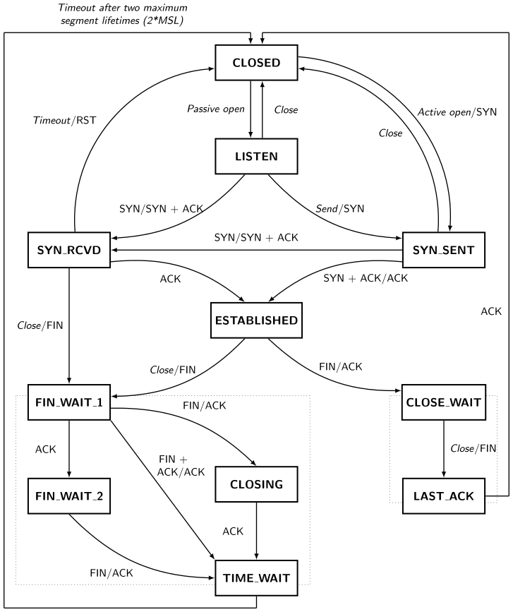

Title: Seven Days of Creation
Date: 2022-09-18 12:00
Category: Programming
Tags: Programming, Systems
Slug: seven-days-of-creation
Summary: When you learn more in the last week than in any other week in your life. A summary of how I built a high-performance peer-server-peer file sharing network in the span of a week.

## Day One

> In the beginning, God created sockets. Now the sockets were isolated, unable to connect to anything on the system. And God said, **"Let there be syscalls"**, and there were syscalls.

Having decided to go as close to the metal as I could for performance reasons (the assignment requirements stated that we'd have to transfer a 100 MB file to 100 clients simultaneously, in a reasonable amount of time), I decided to cut no corners. Fortunately, socket programming is very well documented, and is actually one of the more reasonable subsystems of the Linux/BSD kernel (POSIX sockets API FTW!). 

There are a lot of guides online for this, but the best one is [Beej's network programming guide](https://beej.us/guide/bgnet/pdf/bgnet_a4_c_1.pdf), now updated for IPv6 ^\_^. This goes through the basics of a lot of what is needed, namely the socket syscalls (`socket`, `bind`, `connect`, `accept`, `send`, `recv`, `sendto`, `recvfrom`, `close`) and a lot of other things, such as getting address information, setting socket options with `setsockopt` (and the various options available), making sockets nonblocking, as well as a small tutorial on `select` for asynchronous IO<sup><a href="#footnote-1">1</a></sup>.

I won't be repeating whatever was mentioned there, but a few things that tripped me up were:

1. `SO_REUSEADDR`. Yep. The first time [I read about this flag](https://stackoverflow.com/questions/14388706/how-do-so-reuseaddr-and-so-reuseport-differ), I understood nothing. It was only after I could not reconnect to my server immediately after shutting it down did I realize that something's up. TCP's TIME_WAIT state persists _after_ the application has shut down, which is why if you close and restart a socket at the same port, it won't immediately rebind, as there may still be a FIN/ACK message out on the network, bound for this port. If that hits the second application, it would cause that application's port to shut down, which is why TIME_WAIT waits for 2 maximum segment lifetimes (approx. 30 to 120 seconds). Here's a TCP state diagram to help out, if the above didn't make sense

    

2. `SO_RCVLOWAT`. TCP is a stream protocol, and not a datagram protocol, and I think nobody makes it obvious what the differences are between them.

    * Reading from a SOCK_STREAM port (TCP) is like sucking bits from a straw on the network. `recv(fd, buf, len, flags)` will read<sup><a href="#footnote-2">2</a></sup> atmost `len` bytes from `fd`'s read buffer to `buf`. It doesn't care whether the bytes were part of a previous message, or if it's two messages, it will just read that many bytes in. If the entire message hasn't reached, it will read less than `len` bytes, and return the number of bytes read (basically reading partial messages).
    * Reading from a SOCK_DGRAM port (UDP) is like eating potato chips from a pringles tube, one at a time. `recv(fd, buf, len, flags)` on a UDP port will read _min(len,size of one datagram)_ into buf. This means that you only get single datagrams. The port will read an incomplete datagram **only if len is less than the size of one datagram**, otherwise you're guaranteed to read the complete datagram in, notwithstanding system/network errors.

    So, how do we emulate UDP's 'chunking' in TCP? The `SO_RCVLOWAT` parameter sets a low water mark for the socket read buffer: we are only alerted of a read if the number of bytes in the read buffer are more than those set by this flag (a blocking read will wait until the number of bytes is more than this, or the socket has closed). By setting the low water mark and our buffer length to the size of one 'packet' of information that we are expected to receive, we can read only one packet at a time, cleanly separated from the rest of the byte stream. Neat!

3. **Respect the error message!** I cannot stress on this enough. Always, **ALWAYS** check what these syscalls are returning. You'll save yourself a lot of pain. An example: this is terrible code

```c++
// some code here
getaddrinfo(nullptr, std::to_string(port).c_str(), &hints, &res);

uintptr_t fd = socket(res->ai_family, res->ai_socktype, res->ai_protocol);

const int reuse = 1;
setsockopt(fd, SOL_SOCKET, SO_REUSEADDR, &reuse, sizeof(reuse));

bind(fd, res->ai_addr, res->ai_addrlen);
fcntl(fd, F_SETFL, O_NONBLOCK);
freeaddrinfo(res);
// more code here
```

Do you see the error? Exactly. You'll never see the error, until it blows up in your face 500 lines later. Your server needs to fail fast while debugging. There's no shame in throwing assert statements around like confetti.

```c++
std::string errstr(std::string msg) {
  return msg + " (errno " + std::to_string(errno) + ")";
}

// ...

int ret = getaddrinfo(nullptr, std::to_string(port).c_str(), &hints, &res);
assert (ret != -1 and errstr("Could not get address information"));

uintptr_t fd = socket(res->ai_family, res->ai_socktype, res->ai_protocol);
assert (fd != -1 and errstr("Could not create socket"));

const int reuse = 1;
ret = setsockopt(fd, SOL_SOCKET, SO_REUSEADDR, &reuse, sizeof(reuse));
assert (ret != -1 and errstr("Could not set SO_REUSEADDR option"));

ret = bind(fd, res->ai_addr, res->ai_addrlen);
assert (ret != -1 and errstr("Could not bind socket to port"));

// ...
```

## Day Two

> And God said, **"Let there be an event loop so that sockets can know when they have to read and write"**, So God made an event loop and registered his sockets to it.

Possibly the most fun part of this entire exercise. Event loops allow you to write superfast single-threaded concurrent servers, simply because the OS doesn't need to schedule a bunch of threads waiting for their clients to reply to them. In macOS (and other BSD distros), the kernel uses `kevent` for the event queue, but if you're looking to port to linux, [`libkqueue`](https://github.com/mheily/libkqueue) works like a charm (just make sure to build and install the latest version: the ones on the default package repositories are outdated and have bugs).

Event loops and the reactor pattern are not-so-easy to understand, so [here](https://dzone.com/articles/understanding-reactor-pattern-thread-based-and-eve) and [here](http://www.dre.vanderbilt.edu/~schmidt/PDF/reactor-siemens.pdf) were some good resources I referred to. A broad overview (when applied to sockets) is:

* Each socket has a file descriptor, along with a read/write buffer (in the kernel).
* An event queue allows us to register this file descriptor with the queue, such that we are alerted when we can read/write from this file.

What does an event queue look like? Here's a (rough) abstraction from my code:

```c++
struct event_t {
    int fd;
    int filter;
    void* data;
}

class EventQueue {
public:
    EventQueue();
    void add_event(const event_t& e);
    void delete_event(const event_t& e);
    std::vector<event_t> get_events();
    void close();
}
```

simple enough. Where does the event loop come in? The loop is responsible for polling the event queue and processing the events that occur

```c++
void run() {
    EventQueue evtq;
    // add events here
    while (running) {
        auto evts = evtq.get_events();
        for (const auto& e : evts) {
            // process e;
        }
    }
}
```

Generally, a callback-like structure is employed within the event loop

```c++
std::unordered_map<int,std::function<void()>> read_callbacks;

//...

void register_read_callback(int fd, std::function<void()> f) {
    read_callbacks[fd] = f;
}

// inside the event loop
        for (const auto& e : evts) {
            // ...
            if (e.filter == EV_READ) read_callbacks[e.fd]();
            // ...
        }

```

Short and sweet, add more callbacks as needed.

There's a very nice [kqueue tutorial](https://wiki.netbsd.org/tutorials/kqueue_tutorial/) here, which goes into more specifics; stuff such as timers and one-shot events, but read/write events on sockets should be enough to scale.

## Day Three

> And God said, **"Let there be a client to keep the server company"**, and it was so. God made a client using the same principles as the server, and God saw that it was good.

## Day Four

> And God said, **"Let there be two implementations of the protocol, for testing purposes"**, and it was so. God set about refactoring the codebase, abstracting the interfaces and implementation out, and when he was done, he saw that it was good.

## Day Five

> And God said, **"Let this bounty be available to the users of Linux as well"**, and it was so. God did not have a working Linux machine, so he created a QEMU VM to run Manjaro and to compile the code, and when he was done, he saw that it was good.

## Day Six

> And God said, **"Let there be a client manager to spawn clients, so that I may be absolved of the burden of testing"**, and it was so. God crafted a client manager using threads, and did the server benchmarks, and he saw that they were good.

## Day Seven

> Thus, the clients and server were completed in all their vast array, so on the seventh day, God rested from all his work. Then God <strike>Blessed the seventh day and made it holy</strike> _Cursed himself for having spent so much time on one assignment, when there were four more to do, and minors would begin in a week_

## Appendix: The Garden of Eden

When 

## Footnotes

<sup id="footnote-1">1</sup> `select` can handle only 1024 events, and is linear in time, which makes it a very bad choice. More modern implementations use kqueue(BSD/macOS), epoll(Linux) or IOCP(Windows). A cross-platform option is to use [libevent](https://libevent.org/).

<sup id="footnote-2">2</sup> `recv` will block (wait until there are nonzero bytes in the read buffer) if the socket is blocking, and will read atmost `len` bytes to `buf` (the number of bytes read are returned by the syscall). If the socket is non-blocking, `recv` may return 0 if there's nothing in the buffer to read. Note that if a blocking `recv` returns 0, it means that the connection has been disconnected (why? Don't really know, but I guess it's because there's an EOF residing in the buffer, sent by the other party, up to which `recv` reads, and then there's nothing left to read but the EOF).

