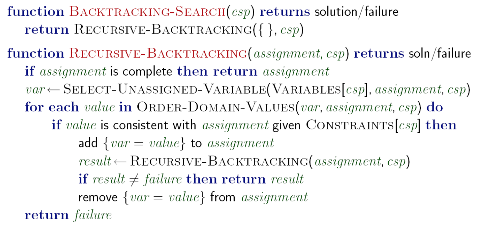

Title: A Simple Sudoku Solver
Date: 2022-09-03 17:00
Category: Programming
Tags: Programming
Slug: simple-sudoku-solver

## The Problem

The problem is a simple search problem: given a partially filled sudoku board, return a fully filled sudoku board with the initial numbers in place such that each digit features only once in every row, column and 3x3 subgrid.

## The Solution

These problems, in general, are called [Constraint Satisfaction Problems](https://en.wikipedia.org/wiki/Constraint_satisfaction_problem). Given a set of constraints, find a valid solution which satisfies all the constraints.

A CSP is generally represented as a graph, with each variable as a node and a constraint between two variables as an edge. [Sudoku Graphs](https://en.wikipedia.org/wiki/Sudoku_graph) are well-studied, and here's an example of a 9x9 one (courtesy [Artacho and Campoy](https://www.researchgate.net/figure/b-Graph-coloring-of-Sudoku_fig9_311668725))


This gives us a nice formulation, and allows us to search for a solution on this graph using backtracking search (Pseudocode courtesy [Rohan Paul's Slides](https://www.cse.iitd.ac.in/~rohanpaul/teaching/data/2022-COL333/L06-Constraint-Satisfaction.pdf))



The two key algorithmic decisions to make here are:

1. In what order do we select unassigned variables
2. In what order do we assign values to the unassigned variable chosen?

This is the crux of the functions `select-unassigned-variable` and `order-domain-values`. Thinking about it a bit more:

1. We want to first fill the variables whose values we already know: the ones which have only one possible value ie are fully constrained. This is designed to fail fast, and will make the search go quicker. Hence, the ordering here should be **choose the most constrained variable**. 
    * Note that among variables with the same number of constraints, to break ties, we'd choose the variable **with the greatest degree**, however for sudoku all the vertices have the same degree so it doesn't really matter.
2. We want to fill the values that are the least used in the board first, that is, the most likely values (that would rule out the fewest values in the remaining variables). We want to fail last while making this assignment, so we choose **The most likely variable**.

There are a few more optimizations, such as forward checking, but for a simple sudoku solver, these should be sufficient.

## The Implementation

With the algorithm in mind, I cooked up a quick implementation in C++. I used the following bitboard structure:
```cpp
// Sudoku bitboard:
struct board_t {
    uint8_t data[324];
    uint8_t gs[90];
    uint8_t rs[90];
    uint8_t cs[90];
    uint8_t ns[10];
    uint8_t n_set;

    board_t(): data{0}, gs{0}, rs{0}, cs{0}, ns{0}, n_set{0} {}
};
```

This structure makes checks constant time, and since we're having a mutable bitboard, size isn't really an issue (this clocks in at ~600 bytes). 

The core backtracking algorithm itself looks like this:

```cpp
bool solve(board_t& b) {


    if (b.n_set == 81) return true;
    //std::cout << (int)b.n_set << std::endl;
    // choose the most constrained cell c in b
    int mcc = get_mcc(b); // I think this takes the most time now...
                          // atleast 729 ops.
    int i = mcc/9;
    int j = mcc%9;

    std::vector<int> moves;
    for (int k=1; k<=9; k++) {
        board::set(b,j,i,k);
        if (board::check(b,j,i)) moves.push_back(k);
        board::unset(b,j,i);        
    }

    // move ordering... fail last
    sort(moves.begin(), moves.end(), [b](int m1, int m2) {
        return b.ns[m1] > b.ns[m2];
    });
    for (int m : moves) {
        board::set(b,j,i,m);
        bool solved = solve(b);
        if (solved) return true;
        else board::unset(b,j,i);
    }

    return false;
}
```

The only issue? It's _slow_

## The Performance

Initially, I was mighty pleased with myself for creating such a nice solver: it solved [Arto Inkala's Unsolvable Sudoku](https://www.sudokuwiki.org/sudoku.htm?bd=800000000003600000070090200050007000000045700000100030001000068008500010090000400) in less than a second, as well as [#28](https://www.sudokuwiki.org/Weekly_Sudoku.asp?puz=28) of the unsolveable sudoku puzzles in less than two seconds. 

Then I saw how sudoku solver benchmarks are actually done

## State of the art

Currently, this is [tdoku](https://t-dillon.github.io/tdoku/). Beautifully written and explained, tdoku takes **41.7 us** on average for very difficult puzzles with Sudoku Explainer ratings of 11 or higher

And mine?

300,000 us

Yep.

From an instant to an eternity. Well, atleast there's still a long way to go! I had to limit my solver to solve only a hundred puzzles from the same dataset, otherwise it wouldn't terminate. 

## Conclusion

This is by no means a conclusive solver: there are still a lot of optimizations I can make, such as faster move generation and some SIMD stuff to make checks faster, but I think I'll get to those later. Now, the tree search would need to be optimized first. 

This was hacked up in ~3 hours, and you can find the entire code [here](https://gist.github.com/Aniruddha-Deb/45055de874701009525de9d04e044382)

Happy sudoku solving!