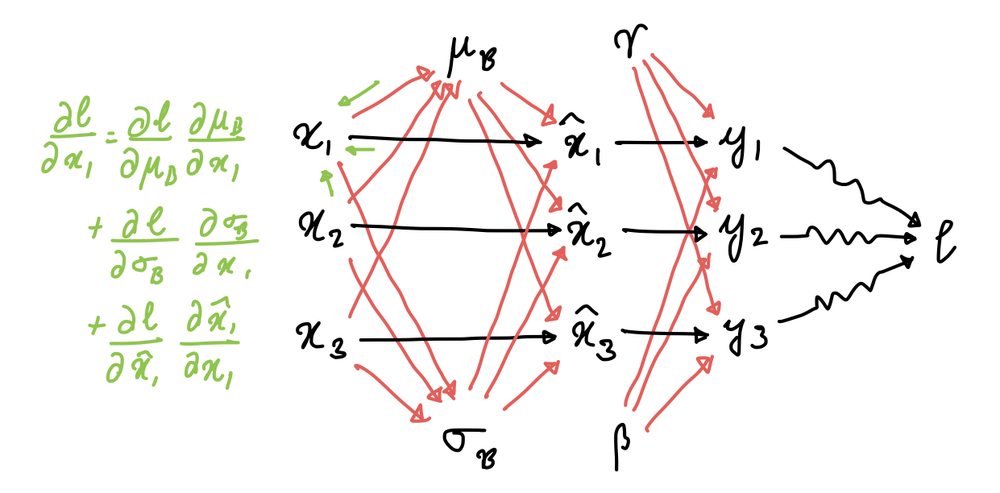
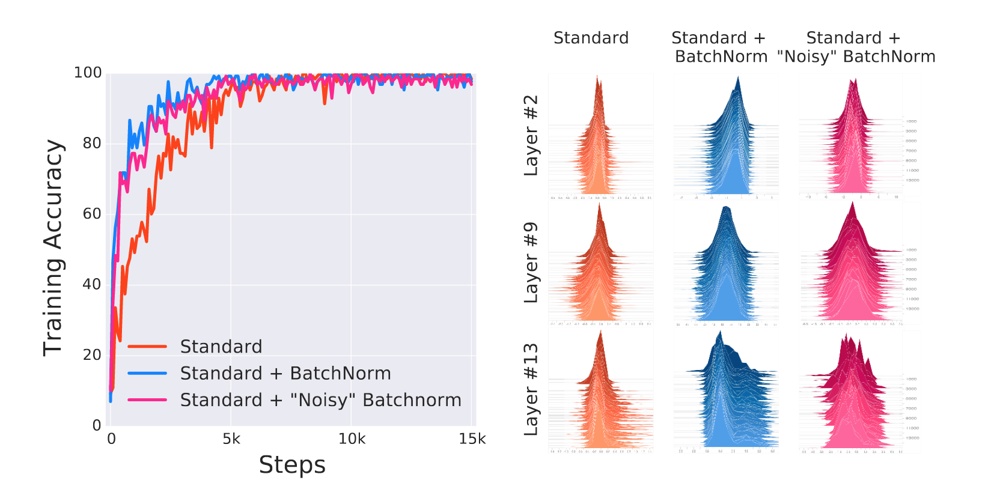
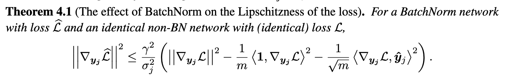

Title: Batch Normalization
Date: 2023-02-16 16:00
Category: Mathematics
Tags: Mathematics, Machine Learning, Deep Learning
Slug: batch-normalization

$$
\require{physics}
\newcommand{B}{\mathcal{B}}$$

Batch Normalization was proposed by [Ioffe and Szegedy](http://static.googleusercontent.com/media/research.google.com/en//pubs/archive/43442.pdf)
in 2015, and it spawned several normalization techniques that are used in SOTA
models today (layer norm, weight norm, etc). Batch normalization normalizes
the output of each layer based on the mean and variance of the examples in the
current batch. Formally, if $\B = \{x_1, \ldots, x_m\}$ is our batch, then 
batch norm does the following transformation:

$$\begin{align}
\mu_{\B} &= \frac{1}{m} \sum_i x_i \\\\
\sigma_{\B}^2 &= \left( \frac{1}{m} \sum_i x_i^2 \right) - \mu_{\B}^2 \\\\
\hat{x}\_i &= \frac{x_i - \mu_{\B}}{\sqrt{\sigma^2_{\B} + \epsilon}} \\\\
y_i &= \gamma \hat{x}\_i + \beta 
\end{align}$$

### Why?

When networks are trained, the partial derivative of a parameter obtained 
during backprop gives us the gradient _assuming all other parameters remain
constant_. This is not true, as the parameters simultaneously change. This 
causes the input distribution to a layer in a deep neural network to change
significantly from update to update, and this is called _Internal Covariate 
Shift_.

Mathematically, if we have a simple linear model $y = w_l w_{l-1} \ldots w_1 x$, and
we update each parameter via the partial derivative of that parameter, then we
get $\hat{y} = (w_l - \epsilon g_l) \ldots (w_1 - \epsilon g_1) x$. Note how even the
second order terms ($\epsilon^2 (\prod_{i=l}^3 w_i)g_2 g_1$) may become very large,
making learning harder.

Batch norm aims to reduce internal covariate shift by normalizing the layers.
This centers them and reduces variance due to noisy parameter updates, while not
taking any information away (the model is still free to learn whatever mean
and variance it chooses to learn by updating $\gamma$ and $\beta$.)

### Backprop

Before manually doing the backprop, a computation graph really helps here.

This is a small computation graph that uses just three examples, but it's
sufficient to show which variables are dependent on each other, and how. This
allows us to go ahead and obtain all the partial derivatives via chain rule:

$$\begin{align}
\pdv{l}{\gamma} &= \sum_i \pdv{l}{y_i} \hat{x}\_i \\\\
\pdv{l}{\beta} &= \sum_i \pdv{l}{y_i} \\\\
\pdv{l}{\hat{x}\_i} &= \pdv{l}{y_i} \gamma \\\\
\end{align}$$

The next three are a bit tricky. To check the derivation, just follow the edges
of the computation graph.
$$\begin{align}
\pdv{l}{\mu_{\B}} &= \sum_i \pdv{l}{x_i} \pdv{x_i}{\mu_{\B}} \\\\
                  &= \sum_i \pdv{l}{x_i} \cdot \frac{-1}{\sqrt{\sigma^2_{\B} + \epsilon}} \\\\
\pdv{l}{\sigma^2_{\B}} &= \sum_i \pdv{l}{x_i} \pdv{x_i}{\sigma^2_{\B}} \\\\
                       &= \sum_i \pdv{l}{x_i} \cdot \frac{-1}{2} \cdot \frac{(x_i - \mu_{\B})}{\left(\sigma^2_{\B} + \epsilon\right)^{3/2}} \\\\
\pdv{l}{x_i} &= \pdv{l}{\hat{x}\_i}\pdv{\hat{x}\_i}{x_i} + \pdv{l}{\sigma^2_{\B}}\pdv{\sigma^2_{\B}}{x_i} + \pdv{l}{\mu_{\B}}\pdv{\mu_{\B}}{x_i} \\\\
             &= \pdv{l}{\hat{x}\_i}\frac{1}{\sqrt{\sigma_{\B}^2 + \epsilon}} + \pdv{l}{\sigma^2_{\B}}\frac{2(x_i-\mu_{\B})}{m} + \pdv{l}{\mu_{\B}}\frac{1}{m} 
\end{align}$$

This is what the paper mentions as well. With a few modifications, the derivatives
here can be vectorized: <strike>$\pdv{l}{\alpha}$ would become $\grad_\alpha l$, and
the other derivatives would become jacobians. The division would become pointwise,
and so would the multiplication at some places.</strike> EDIT: I realized that
it's easier to do this in a component-wise fashion: $x_i$ would become $x_i^{(j)}$,
the $j$th component of the $i$th example in the batch. This is also how
[Wikipedia](https://en.wikipedia.org/wiki/Batch_normalization) does it.

### Deeper Intuition

This very nice paper by [Kohler et al](https://arxiv.org/pdf/1805.10694.pdf) shows
that Batch Normalization (and friends) may be thought of as a _reparameterization
of the weight space_. In matrix notation, The normalization operation amounts
to computing the following:

$$\text{BN}(x^TW) = \gamma \frac{x^TW - \text{E}(x^TW)}{\text{Var}(x^TW)^{1/2}} + \beta$$

Assuming $x$ is zero-mean, we can rewrite the variance as

$$\begin{align}
\text{Var}(x^TW) &= \text{E}\left((x^TW)^2\right) \\\\
                 &= \text{E}(W^Txx^TW) \\\\
                 &= W^T \text{E}(xx^T) W \\\\
                 &= W^T S W
\end{align}$$

where S is the covariance matrix of $x$. If we rewrite the weights as $\hat{W} = \gamma \frac{W}{(W^T S W)^{1/2}}$,
then the output of the layer after batch normalization is simply $x^T \hat{W}$.
Thus, we've reparameterized the weight matrix, making it account only for the
direction in the covariance space $S$ and letting $\gamma$ determine the 
magnitude. [Weight Normalization](https://arxiv.org/pdf/1602.07868.pdf) does the
same thing, but $S$ is replaced by $I$.

### Does it work?

According to newer work, yes but no. [Santurkar et al](https://proceedings.neurips.cc/paper/2018/file/905056c1ac1dad141560467e0a99e1cf-Paper.pdf)
show that Internal Covariate Shift is not as detrimental to learning as thought
of, by synthetically injecting noise _after_ BatchNorm layers. The result was
that the network doesn't do as poorly as expected, but it still outperforms 
the standard network.

The explanation that they gave was that Batch norm assists the optimizer by
making the loss landscape smoother. Formally, the magnitude of the gradient of
the loss $||\grad_{y_j}\mathcal{L}||$ captures the smoothness of the loss.
Batch norm reduces the bound on the gradient relative to an un-batch normed 
network significantly.

Batch norm also imposes some second-order constraints on the hessian, which can
intuitively be summarized as saying that the step we take in the direction
of the gradient is more likely to lead us to a minima for a batch-normalized
network compared to an unnormalized network.

---

I'm surprised that people actually read these ^\_^ I haven't posted much due to
minors and assignments, but I'll see if I can post more ML stuff on here if
time permits.

