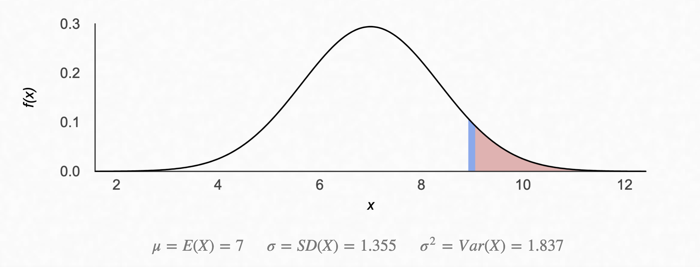
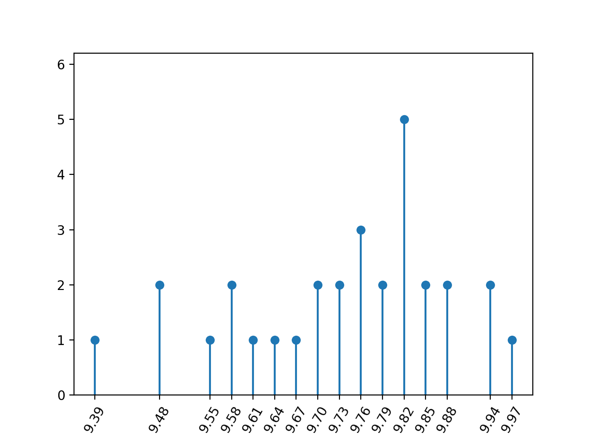

A friend recently asked me to provide some advice on department change to some
freshers. The usual _fundaebaazi_ is something I didn't want to do; it's not 
impressionable, and won't motivate any fresher to study for a department change.
Instead, I chose to show and not tell

## So is it luck or skill?

Short answer: Both.

Let's look at how first year courses are graded. For most theory courses 
(3 lecture hours + 1 tutorial hour / 2 lab hours), there's a normal distribution
of marks, and the top 7% of people on this distribution get an A. 

(Well, the actual grade distribution is discrete, but the marks are 
approximately normally distributed).

If we assume that everyone is equally skilled, then the probability of a person
obtaining an A grade in one course is $0.07$. The probability of the same 
person obtaining an A grade across all the seven theory courses then is $0.07^{7}$.
This seems theoretically okay, but there are only around 1300 people in a batch,
give or take a few hundred. If this is true, the number of people who get a 10 
in every theory course should come out to be $1300 \times 0.07^{7} \approx 10^{-5}$.
Which is practically zero. However, we know for a fact that there are people
who obtain tens across all the seven theory courses, and across the labs as well.
There are people who graduate with a perfect ten, so the above calculation is 
wrong somewhere. This brings us to the first fallacy:

> Not everyone is equally skilled.

There is talent, and there is genius. Talent hits a target no one else can hit.
Genius hits a target no one else can see. 

## How much skill?

Let's condition on the students instead rather than on the gradecard. I would
give a candidate DepC student a probability of $0.8$ to obtain an $A$ in a
theory course, and a probability of $0.5$ to obtain an A in a lab course.
Because lab courses are super random and everyone gets either a 10, 9 or an 8
(CMP and PYP, I'm looking at you). 

With these probabilities, let's reasonably assume that $7$ students get a 
straight ten in all seven theory courses. The number of people with these 
odds would then be $7 / (0.8)^{7} = 33.37 \approx 30$. 

## What about luck?

This is super hard to quantify in words, but I'll give it a shot. Given our 
30 geniuses and taking all permutations and combinations of grades into
account, the set of possible CGPAs one could obtain after their first year is
finite. So what happens if two people obtain the same CGPA and they are in line
for a Department Change into a higher branch?

> In case more than one student applying for programme change have the same
> CGPA, the tie shall be resolved on the basis of JEE ranks of such applicants.

So how likely is it that two people obtain the same CGPA and are required to 
tiebreak on the basis of their JEE rank? Let's run a simulation and find out!
I'll simulate grades across 5 lab courses, 4 of which are worth 2 credits each 
and the last one is worth one credit. I'll also simulate the seven four-credit
theory courses. Also assume that if the genius doesn't get a 10, they get a 9.

We see that nobody gets a 10, and five people get a CG of 9.82. Five! And 
multiple people have the same CG. Even though we assume CGPAs lie on a
continuous scale, the spectrum doesn't become as dense as one would expect 
at the end of first year. 

However, all this shows us is that there are chances of a tiebreak. It still
doesn't put things into perspective. Let's make a fake DepC list, so that the
point really hits home. I'll allocate 7 seats in the 4-year CSE programme, 
2 in 5-year CSE Dual, 6 in Mathematics and Computing, 2 in MathComp Dual and 
assume a similar distribution across others. The final list looks like this:

|    | name               |   cg | from   | to   |
|---:|:-------------------|-----:|:-------|:-----|
|  0 | Anay Shanker       | 9.97 | ME1    | CS1  |
|  1 | Nirvaan Choudhury  | 9.94 | ES1    | CS1  |
|  2 | Sara Behl          | 9.94 | ME2    | CS1  |
|  3 | Kiara Kakar        | 9.88 | MT1    | CS1  |
|  4 | Aniruddh Batra     | 9.88 | MS1    | CS1  |
|  5 | Mehul Krishnan     | 9.85 | MT6    | CS1  |
|  6 | Jhanvi Chaudhary   | 9.85 | CH1    | CS1  |
|  7 | Madhup Kapur       | 9.82 | MT6    | CS5  |
|  8 | Zoya Virk          | 9.82 | MT6    | CS5  |
|  9 | Tara Swaminathan   | 9.82 | AM1    | MT1  |
| 10 | Rasha Kakar        | 9.82 | MS1    | MT1  |
| 11 | Ranbir Brahmbhatt  | 9.82 | MS1    | MT1  |
| 12 | Tarini Ganguly     | 9.79 | ME2    | MT1  |
| 13 | Divij Gupta        | 9.79 | EE3    | MT1  |
| 14 | Taimur Vaidya      | 9.76 | EE1    | MT1  |
| 15 | Lavanya Deo        | 9.76 | EE3    | MT6  |
| 16 | Samiha Karpe       | 9.76 | CE1    | MT6  |
| 17 | Uthkarsh Baral     | 9.73 | CH1    | EE1  |
| 18 | Mishti Ranganathan | 9.73 | CE1    | EE1  |
| 19 | Kashvi Char        | 9.7  | ME1    | EE1  |
| 20 | Azad Sahota        | 9.7  | AM1    | EE1  |
| 21 | Trisha Dhillon     | 9.67 | MS1    | EE1  |
| 22 | Mehul Verma        | 9.64 | BB1    | EE1  |
| 23 | Vaibhav Dewan      | 9.61 | MS1    | EE1  |
| 24 | Myra Tiwari        | 9.58 | ME2    | EE1  |
| 25 | Ishaan Goyal       | 9.58 | CH7    | EE3  |
| 26 | Lakshay Sampath    | 9.55 | CE1    | EE3  |
| 27 | Rati Sanghvi       | 9.48 | ME2    | EE3  |
| 28 | Mahika Ravi        | 9.48 | CH1    | EE3  |
| 29 | Hazel Sethi        | 9.39 | BB1    | AM1  |

My heart goes out to Tara, Rasha, Ranbir, Lavanya, Samiha and Ishaan. The boys
and girls played well, but in the end it came down to luck. And having a better
JEE rank.

## What next?

Making this minigame taught me two things: one, just how incredibly lucky I got
with my own department change, and two, how huge of a factor luck plays. All 
the _fundae_ my seniors gave me about luck and randomness are sort of true. 

My advice to any juniors reading this would be to not worry about the outcome.
The driving force behind most people seeking a DepC is better job prospects 
and possibly the associated social status and prestige that comes with it (which 
is a very freshie thing; nobody cares about which department you're from once
you're a bit more senior). If this is your primary driving goal behind the DepC,
you'll neither gain the skill, nor have the luck. The best course of action 
is to truly enjoy (or atleast make an effort to enjoy) what you're studying,
becaues most of it is an extension of the JEE syllabus anyway, and keep your
CGPA as high as possible. Expect nothing else from the system, and you won't 
be disappointed.

## Appendix: Code for the luck simulation

