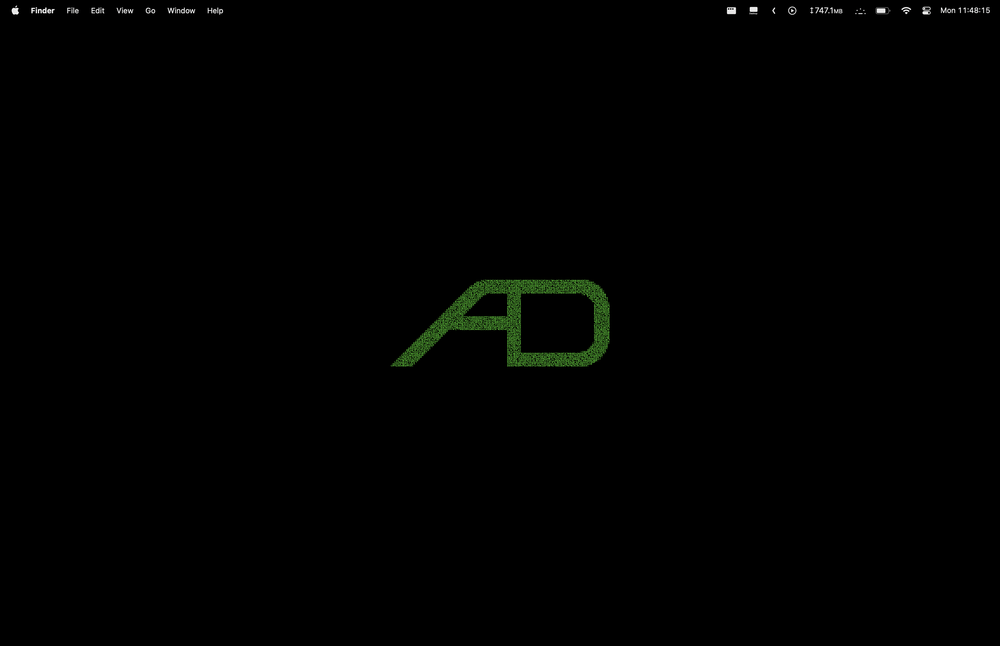
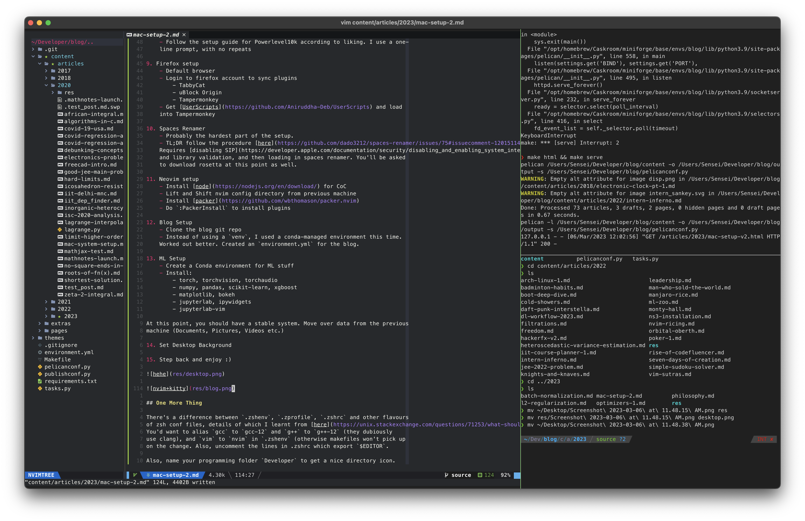

Title: Mac Setup v2
Date: 2023-03-06 12:00
Category: Programming
Tags: Programming
Slug: mac-setup-2

My 2015 MBP 13" was giving me some pain over this entire semester, lagging a lot
and being very slow overall. I recently upgraded to a 16" MBP, and there have
been no complaints so far :) the notch is simply not there if you have a black
desktop background, so +1 to apple for that. Although face ID would have been
nice to have.

## Setup

1. Basic intro Screen
    - Dark Mode 
    
    - Don't set up Siri, or Stage Manager

2. Home Directory and Username renaming
    - MacOS uses a lowercase first letter, even if you've input an uppercase
    one while making your username. The way to change this is a bit complicated,
    but follow the instructions [here](https://support.apple.com/en-in/HT201548)

3. System <strike>Preferences</strike> Settings
    - Turn off autocorrect
    - Function keys are function keys, and not 'do weird stuff' keys
    - Don't switch to a workspace which has an open window of the application
    - Make 10 workspaces and activate all the ^(n) hotkeys to switch to them
    - Change the date/time format to `Day HH:MM:SS` in control center
    - Remove some stuff from control center, put keyboard brightness there
    - Turn off the 'quick note' bottom right hot corner

4. Accounts
    - Google
    - [IITD](https://bsw.iitd.ac.in/email.php)

5. Applications
    - XCode CLT
    - Firefox
    - VS Code (don't use this much)
    - Kitty (with the [cuter icon](https://github.com/DinkDonk/kitty-icon/blob/main/kitty-dark.icns))
    - Calibre
    - TG Pro
    - The Unarchiver
    - Shottr
    - Hidden Bar
    - TinkerTool
        - Hide dock, and delay in showing it
        - Remove 'recent apps' section in Dock
    - Rectangle
    - Bandwidth+

6. [Brew](https://brew.sh/) Packages
    - Neovim
    - htop
    - gcc
    - openmpi
    - miniforge

7. Kitty Setup
    - Download the [Meslo](https://github.com/ryanoasis/nerd-fonts/releases/tag/v2.3.3)
    zipfile from here, and install all the fonts.
    - Copy over the `kitty.conf` from my previous machine. Works out of the box
    (just darkened the background a bit more, as the new mac has a brighter
     display)

8. [Oh my zsh](https://github.com/ohmyzsh/ohmyzsh)
    - Install [Powerlevel10k](https://github.com/romkatv/powerlevel10k) after this
    - Follow the setup guide for Powerlevel10k according to liking. I use a one-
    line prompt, with no repeats

9. Firefox setup
    - Default browser
    - Login to firefox account to sync plugins
        - TabbyCat
        - uBlock Origin
        - Tampermonkey
    - Get [UserScripts](https://github.com/Aniruddha-Deb/UserScripts) and load
    into Tampermonkey

10. Spaces Renamer
    - Probably the hardest part of the setup. 
    - TL;DR follow the procedure [here](https://github.com/dado3212/spaces-renamer/issues/75#issuecomment-1201511482).
    Requires [disabling SIP](https://developer.apple.com/documentation/security/disabling_and_enabling_system_integrity_protection)
    and library validation, and then loading in spaces renamer. You'll be asked
    to download rosetta at this point as well.

11. Neovim setup
    - Install [node](https://nodejs.org/en/download/) for CoC
    - Lift and Shift nvim config directory from previous machine
    - Install [packer](https://github.com/wbthomason/packer.nvim)
    - Do `:PackerInstall` to install plugins

12. Blog Setup
    - Clone the blog git repo
    - Instead of using a `venv`, I used a conda-managed environment this time.
    Worked out better. Created an `environment.yml` for the blog.

13. ML Setup
    - Create a Conda environment for ML stuff
    - Install:
        - torch, torchvision, torchaudio
        - numpy, pandas, scikit-learn, xgboost
        - matplotlib, bokeh
        - jupyterlab, ipywidgets
        - jupyterlab-vim

At this point, you should have a stable system. Move over data from the previous
machine (Documents, Pictures, Videos etc.)

14. Set Desktop Background

15. Step back and enjoy :)

## One More Thing

There's a difference between `.zshenv`, `.zprofile`, `.zshrc` and other flavours
of zsh conf files, details of which I learnt from [here](https://unix.stackexchange.com/questions/71253/what-should-shouldnt-go-in-zshenv-zshrc-zlogin-zprofile-zlogout).
You'd want to alias `gcc` to `gcc-12` and `g++` to `g++-12` (they dubiously
use clang), and `vim` to `nvim` in `.zshenv` (otherwise makefiles won't pick up
on the change. Also, uncomment the lines in .zshrc which export `$EDITOR`.

Also, name your programming folder `Developer` to get a nice directory icon.
